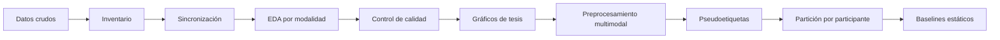

# Mapa del proyecto MDS

## Visión general

- [[README|Descripción y ejecución]]
- [[documentacion/RESUMEN_PROCESO|Resumen de todo lo realizado]]
- [[documentacion/DOCUMENTACION_DATOS_MDS|Diccionario de datos]]
- [[datos/README|Datos crudos locales]]

## Flujo

- [[documentacion/SINCRONIZACION_SENALES|Sincronización EEG–Tobii]]
- [[documentacion/EDA_SENALES|Índice de EDA]]
- [[documentacion/GRAFICOS_TESIS|Figuras finales]]
- [[documentacion/PREPROCESAMIENTO_MULTIMODAL|Preprocesamiento reproducible]]
- [[resultados/preprocesamiento/auditoria_participantes.csv|Auditoría del preprocesamiento]]
- [[documentacion/ETIQUETAS_Y_BASELINES|Etiquetas, partición y baselines]]
- [[resultados/modelado/particion_participantes.csv|Partición congelada]]
- [[resultados/modelado/metricas_baselines.csv|Métricas fuera de muestra]]
- [[resultados/resumen_calidad_fuentes.csv|Calidad por fuente]]

## Señales

| Señal | Nota | Resultado |
|---|---|---|
| EEG | [[documentacion/EDA_EEG|EDA EEG]] | 44/48 utilizables |
| GSR | [[documentacion/EDA_GSR|EDA GSR]] | 47/49 disponibles |
| Pupilometría | [[documentacion/EDA_EYE_PUPIL#Pupilometría|EDA pupilar]] | 90,25 % válido |
| Eye tracking | [[documentacion/EDA_EYE_PUPIL#Eye tracking|EDA de mirada]] | 94,98 % válido |

## Código

- [[scripts/sincronizar_senales.py|Sincronización]]
- [[scripts/eda_eeg.py|EDA EEG]]
- [[scripts/eda_gsr.py|EDA GSR]]
- [[scripts/eda_eye_pupil.py|EDA ocular]]
- [[scripts/graficos_tesis.py|Gráficos]]
- [[scripts/ejecutar_todo.py|Pipeline completo]]
- [[scripts/preprocesamiento_secuencial.py|Preprocesamiento multimodal]]
- [[scripts/preparar_modelado.py|Pseudoetiquetas y partición]]
- [[scripts/baselines_estaticos.py|Baselines estáticos]]

## Infraestructura

- [[cluster/Librerias|Librerías del clúster]]
