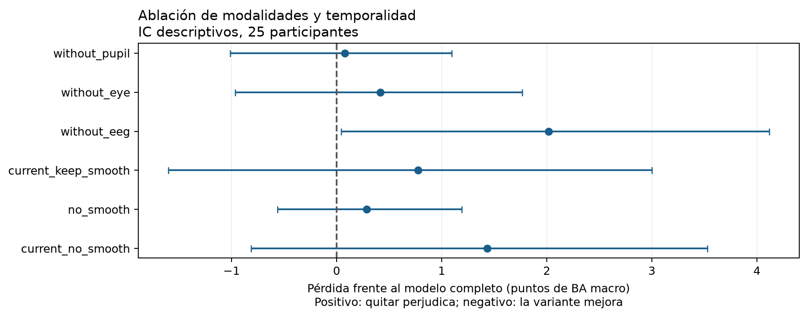
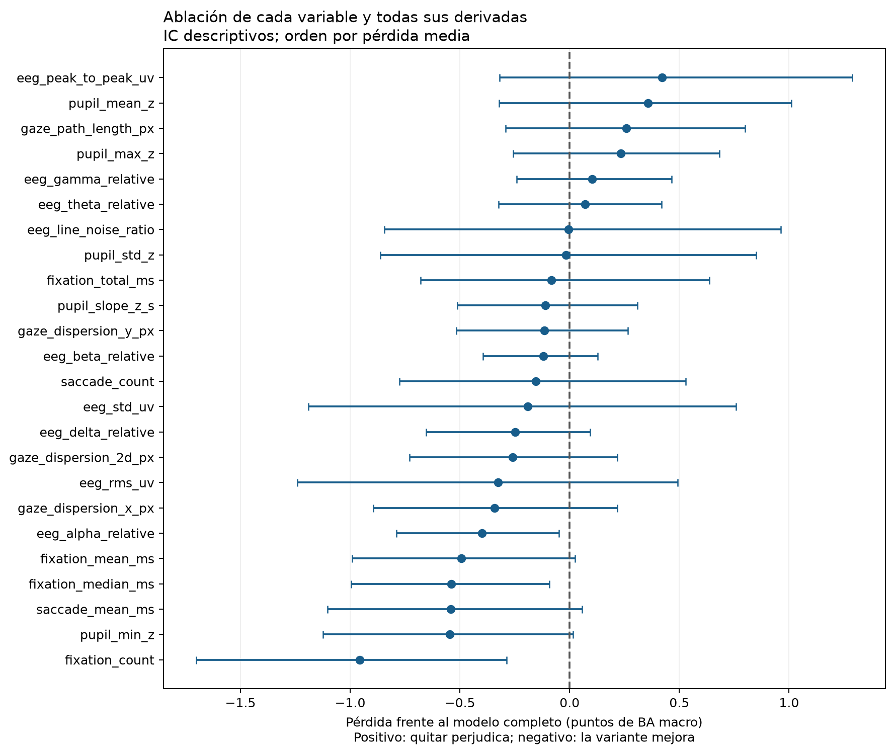
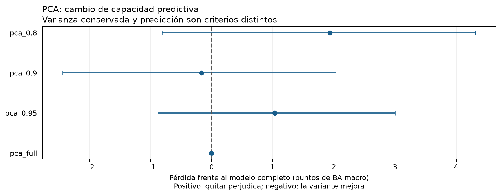
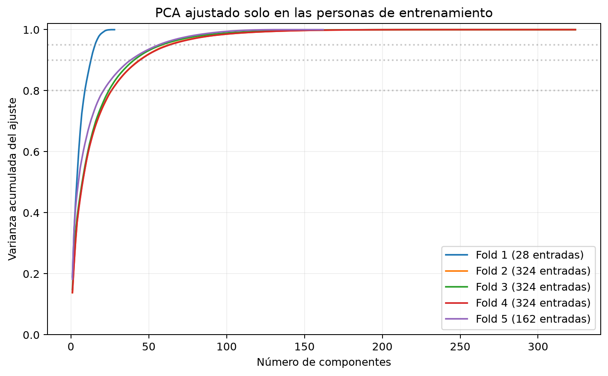

# Ablación y PCA para activación: 12-09-2026

Se completaron 38 variantes en cinco folds: **190 modelos reentrenados y guardados**,
513.912 predicciones verificadas, 190 preprocesadores reajustados y 20 PCA reajustados
en auditoría. La referencia reproduce el Ridge anterior: BA macro 0,37475. El estudio
mantiene arousal_label_6s, las 25 personas de train, las tres clases y los hiperparámetros
elegidos previamente dentro de cada fold. No se volvió a evaluar validation/test.

## Qué se compara y qué significa

Se quita cada modalidad, se conserva cada modalidad por separado y se elimina cada una
de las 24 variables originales con TODAS sus derivadas temporales e indicadores de
ausencia. Cada variante reajusta imputación, escalado y Ridge solo con las 20 personas
de ajuste; las cinco externas se usan para medir el resultado. GSR y las etiquetas no
entran al estudiante. No se prueban nuevas variantes de atención en esta ronda.

La contribución se define como **BA del modelo completo menos BA de la variante**.
Una pérdida positiva significa que quitar esa entrada perjudica al modelo; una negativa
significa que quitarla mejoró el promedio observado. Se informa contribución predictiva
condicionada a este modelo e hiperparámetros, no importancia fisiológica ni causalidad.
Variables correlacionadas pueden compensarse. Las modalidades aisladas evalúan suficiencia,
mientras que quitar una modalidad evalúa su aporte adicional al resto.

Los contrastes principales declarados son quitar EEG, mirada o pupila y quitar conjuntamente
historial/suavizado. Las variables individuales y los niveles de PCA son secundarios.
Los IC son descriptivos: 2.000 remuestreos pareados por persona; no corrigen múltiples
comparaciones, búsquedas previas ni dependencia entre folds. No se elige retrospectivamente
un nuevo panel final usando estos resultados externos.

## Modalidades y temporalidad

| variant | macro_score | loss_vs_reference | ci_low | ci_high | people_hurt_by_removal |
|---|---|---|---|---|---|
| reference | 0.3747 | 0.0000 | 0.0000 | 0.0000 | 0 |
| without_pupil | 0.3740 | 0.0008 | -0.0101 | 0.0110 | 14 |
| only_pupil | 0.3616 | 0.0132 | -0.0122 | 0.0392 | 16 |
| without_eye | 0.3706 | 0.0042 | -0.0096 | 0.0177 | 12 |
| only_eye | 0.3470 | 0.0277 | 0.0081 | 0.0488 | 19 |
| without_eeg | 0.3546 | 0.0202 | 0.0005 | 0.0412 | 17 |
| only_eeg | 0.3722 | 0.0025 | -0.0185 | 0.0221 | 14 |
| current_keep_smooth | 0.3670 | 0.0078 | -0.0160 | 0.0300 | 13 |
| no_smooth | 0.3719 | 0.0028 | -0.0056 | 0.0119 | 11 |
| current_no_smooth | 0.3604 | 0.0143 | -0.0081 | 0.0353 | 15 |

Quitar EEG produce la mayor pérdida media entre modalidades: 0,37475 a 0,35456. Solo EEG
mantiene 0,37222, cercano al modelo completo; sin embargo, su recall medio cae de 0,2327
a 0,1079 y macro-F1 de 0,3646 a 0,3385. Acotar a EEG requiere resolver ese intercambio,
además de confirmación independiente. Quitar mirada da 0,37058 y quitar pupila 0,37397.
La pérdida al quitar EEG es +2,019 puntos de BA, IC descriptivo [+0,045; +4,116].
No se aplica una corrección por múltiples comparaciones. Los intervalos de las otras
modalidades y de las variables individuales no permiten establecer un orden firme.

Usar ventana actual con el mismo suavizado obtiene 0,36699; quitar solo el suavizado,
0,37191; quitar ambos, 0,36041. No son modelos temporales idénticos en los cinco folds:
la referencia elegida usa actual en fold 1, multiescala en 2/4, desfase en 3 y variables
relativas en 5. El fold 1 ya carece de historial de entradas y el fold 5 ya carece de
suavizado. Cambiar a actual elimina también la transformación/desfase correspondiente.
Estos controles no aíslan una arquitectura de red específica.

## Variables originales

Ranking completo por pérdida al quitar cada variable; las cifras están en unidades de BA,
no en porcentaje. Los intervalos amplios impiden interpretar diferencias pequeñas como
un orden definitivo de importancia.

| feature | macro_score | loss_vs_reference | ci_low | ci_high | people_hurt_by_removal |
|---|---|---|---|---|---|
| eeg_peak_to_peak_uv | 0.3705 | 0.0042 | -0.0032 | 0.0129 | 10 |
| pupil_mean_z | 0.3712 | 0.0036 | -0.0032 | 0.0101 | 16 |
| gaze_path_length_px | 0.3722 | 0.0026 | -0.0029 | 0.0080 | 15 |
| pupil_max_z | 0.3724 | 0.0023 | -0.0026 | 0.0068 | 14 |
| eeg_gamma_relative | 0.3737 | 0.0010 | -0.0024 | 0.0046 | 13 |
| eeg_theta_relative | 0.3740 | 0.0007 | -0.0032 | 0.0042 | 11 |
| eeg_line_noise_ratio | 0.3748 | -0.0001 | -0.0084 | 0.0096 | 8 |
| pupil_std_z | 0.3749 | -0.0002 | -0.0086 | 0.0085 | 11 |
| fixation_total_ms | 0.3756 | -0.0008 | -0.0068 | 0.0064 | 11 |
| pupil_slope_z_s | 0.3759 | -0.0011 | -0.0051 | 0.0031 | 14 |
| gaze_dispersion_y_px | 0.3759 | -0.0011 | -0.0052 | 0.0026 | 10 |
| eeg_beta_relative | 0.3759 | -0.0012 | -0.0040 | 0.0013 | 11 |
| saccade_count | 0.3763 | -0.0015 | -0.0077 | 0.0053 | 9 |
| eeg_std_uv | 0.3766 | -0.0019 | -0.0119 | 0.0076 | 11 |
| eeg_delta_relative | 0.3772 | -0.0025 | -0.0065 | 0.0009 | 10 |
| gaze_dispersion_2d_px | 0.3773 | -0.0026 | -0.0073 | 0.0022 | 12 |
| eeg_rms_uv | 0.3780 | -0.0033 | -0.0124 | 0.0049 | 8 |
| gaze_dispersion_x_px | 0.3782 | -0.0034 | -0.0089 | 0.0022 | 11 |
| eeg_alpha_relative | 0.3788 | -0.0040 | -0.0079 | -0.0005 | 9 |
| fixation_mean_ms | 0.3797 | -0.0049 | -0.0099 | 0.0002 | 7 |
| fixation_median_ms | 0.3801 | -0.0054 | -0.0100 | -0.0009 | 6 |
| saccade_mean_ms | 0.3802 | -0.0054 | -0.0110 | 0.0006 | 5 |
| pupil_min_z | 0.3802 | -0.0055 | -0.0112 | 0.0001 | 7 |
| fixation_count | 0.3843 | -0.0096 | -0.0170 | -0.0029 | 8 |

Las mayores pérdidas medias individuales corresponden a amplitud pico a pico EEG,
media pupilar, recorrido de la mirada y máximo pupilar. Quitar fixation_count produce
el mayor aumento puntual: 0,38433, ganancia +0,957 puntos, IC descriptivo [+0,287; +1,702],
con mejora en 17/25 personas. Macro-F1 sube a 0,3733 y recall medio a 0,2400. Es una
observación secundaria después de comparar
24 eliminaciones; no demuestra que esa variable sea perjudicial fuera de esta muestra.
No se combinan automáticamente las eliminaciones que mejoran, porque sus efectos pueden
interactuar y el panel resultante necesitaría seleccionarse dentro de entrenamiento.

## PCA

PCA se ajusta después de imputación y estandarización, incluye los indicadores de
ausencia generados por el preprocesador y no usa etiquetas para elegir componentes.
Se conserva 80 %, 90 % o 95 % de varianza de ajuste; no hay whitening ni reescalado
posterior. Ridge mantiene alpha=1. Los hiperparámetros no se reajustan por variante.

| variant | macro_score | loss_vs_reference | ci_low | ci_high | people_hurt_by_removal |
|---|---|---|---|---|---|
| pca_0.8 | 0.3554 | 0.0194 | -0.0081 | 0.0432 | 16 |
| pca_0.9 | 0.3764 | -0.0017 | -0.0243 | 0.0203 | 13 |
| pca_0.95 | 0.3644 | 0.0104 | -0.0088 | 0.0300 | 14 |
| pca_full | 0.3747 | 0.0000 | 0.0000 | 0.0000 | 0 |

| variant | min_components | max_components | mean_retained |
|---|---|---|---|
| pca_0.8 | 9 | 27 | 0.8033 |
| pca_0.9 | 13 | 45 | 0.9023 |
| pca_0.95 | 16 | 64 | 0.9524 |
| pca_full | 28 | 324 | 1.0000 |

PCA al 90 % obtiene BA macro 0,37640; al 95 %, 0,36439; al 80 %, 0,35539. Conservar
más varianza no ordena el rendimiento predictivo. PCA completo reproduce la referencia,
como control de la rotación de Ridge. El máximo de 90 % es exploratorio; no constituye
una selección validada de dimensionalidad.

Las cargas y varianzas por componente/fold están en pca_cargas.csv.gz y pca_varianza.csv.
Una carga grande explica una dirección de variación de las entradas, no demuestra
importancia para predecir activación. El signo de las componentes es arbitrario y sus
bases difieren entre folds; no se promedian cargas de componentes supuestamente equivalentes.

## Auditoría, archivos y reproducción

Protocolo y 38 definiciones congelados antes de entrenar. La auditoría recarga los 190
modelos, verifica disjunción de participantes, reconstruye las especificaciones,
reajusta los 190 imputadores/escaladores y los 20 PCA. Comprueba sus subespacios, varianza
y todas las cargas guardadas; recalcula 190 métricas de fold y 950 por participante.
Verifica scores con rtol=atol=1e-12 y clases exactamente iguales; la equivalencia de
PCA completo usa 1e-9 en scores y clases idénticas. El script original compara además
los cinco modelos completos con las predicciones de la ronda anterior.

Entrenamiento: `python scripts/entrenar_ablacion_pca.py`, en una copia sin el directorio
de salida existente. Auditoría: `python scripts/auditar_ablacion_pca.py`. Informe:
`python scripts/informe_ablacion_pca.py`. Carga: agregar scripts al path, joblib.load y
`predecir_ablacion_pca.predict(bundle, frame)` con frame ordenado por persona/grabación/tiempo.
No requiere etiquetas al predecir. El predictor calcula features por variable y después
selecciona las columnas; las pruebas verifican que alterar entradas eliminadas o GSR
no cambia las entradas efectivas. Se conserva la limitación de normalización original offline.
El adaptador de carga requiere solo las señales retenidas y los metadatos temporales;
rellena con NaN las señales eliminadas antes de descartarlas junto con sus derivadas.
Las 59 pruebas finales del proyecto pasan; el registro está en pruebas.json.

Estos resultados ayudan a priorizar un panel reducido para una futura selección interna.
No alcanzan 0,50 ni convierten el máximo observado en una confirmación independiente.

Fuentes metodológicas: [PCA de scikit-learn](https://scikit-learn.org/stable/modules/generated/sklearn.decomposition.PCA.html)
y [efecto de variables correlacionadas en la importancia](https://scikit-learn.org/stable/auto_examples/inspection/plot_permutation_importance_multicollinear.html).
