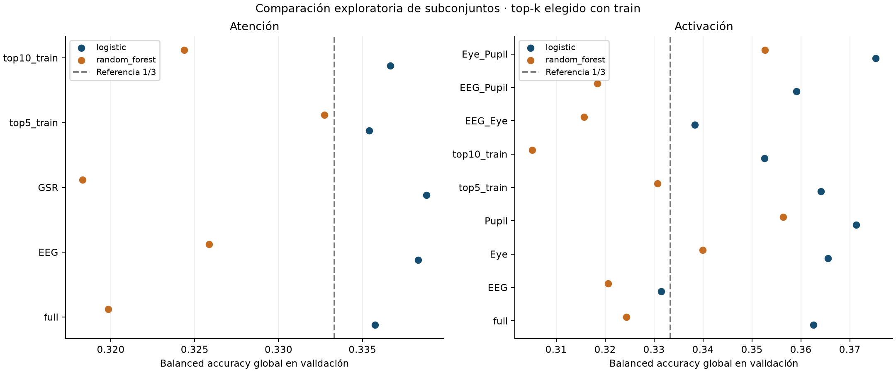
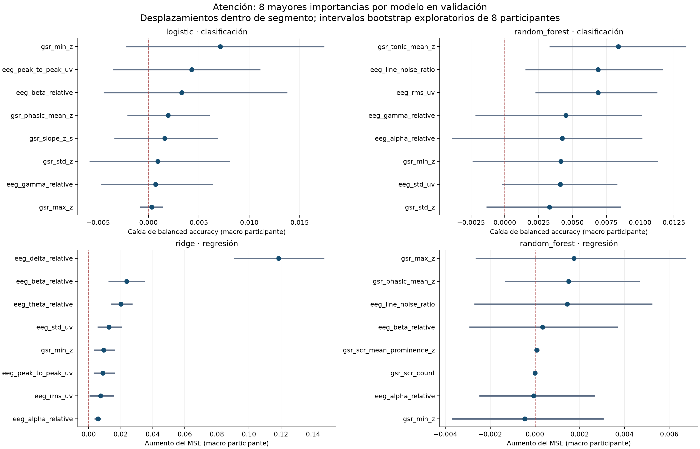
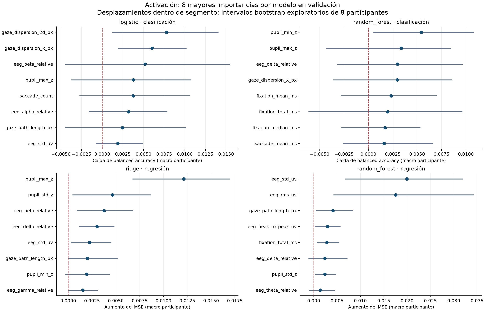

# Variables para predecir atencion y activacion

> Actualización posterior del 07-09-2026: el [contraste interno de estabilidad](Estabilidad_Variables_07-09-2026.md)
> reemplaza esta exploración como fuente para decidir el panel de entradas. La mejora
> inicial de pupila sola no se sostuvo. Se conservan aquí los resultados anteriores.

Análisis exploratorio del 07-09-2026. Fuente: modelos guardados en
`resultados/modelado/ejecuciones/baselines_05-09-2026_02/` y ejecución en
`resultados/analisis_variables_07-09-2026/`.

## Resultado para acotar el problema

**Activación ofrece la reducción más concreta: comparar pupila sola (6 variables) y
mirada + pupila (16) contra el modelo completo (25).** En ambos clasificadores, esos
subconjuntos mejoran el valor puntual global de validación. La mejora macro por
participante tiene intervalos que cruzan cero: todavía no hay evidencia concluyente de
superioridad. La propuesta reduce el espacio del próximo experimento, no confirma que
EEG sea irrelevante.

Para **atención**, cinco entradas mantienen aproximadamente el desempeño de clasificación,
pero este permanece cerca de 1/3. No se identifica todavía un conjunto que permita
predecir atención de forma útil. Es defendible explorar reducción de redundancias,
conservando EEG + GSR como referencia y EEG solo como contraste de modalidad.

Balanced accuracy **global en validación**, no test:

| Objetivo | Entradas | Variables | Logística | Random Forest |
|---|---|---:|---:|---:|
| Atención | EEG + GSR | 18 | 0,3357 | 0,3199 |
| Atención | EEG | 9 | 0,3383 | 0,3259 |
| Atención | Top-5 de train | 5 | 0,3354 | 0,3327 |
| Activación | EEG + mirada + pupila | 25 | 0,3626 | 0,3243 |
| Activación | Pupila | 6 | 0,3713 | 0,3563 |
| Activación | Mirada + pupila | 16 | 0,3753 | 0,3526 |

Referencia trivial para balanced accuracy con tres clases: 0,3333. Las diferencias
globales de esta tabla no son las diferencias macro por participante del CSV: ambas
ponderaciones responden preguntas distintas y pueden incluso cambiar el signo.

## Variables que destacan y cómo interpretarlas

Estas son entradas destacadas por **perturbación en validación para clasificación**.
La magnitud se expresa en puntos porcentuales de balanced accuracy macro por participante.
Los intervalos son exploratorios y no se ajustan por seleccionar entradas del ranking.

| Objetivo / modelo | Variable | Interpretación | Caída media | Intervalo 95 % | Participantes con caída positiva |
|---|---|---|---:|---:|---:|
| Atención / RF | `gsr_tonic_mean_z` | Nivel tónico GSR | 0,840 pp | [0,330; 1,341] | 7/8 |
| Atención / RF | `eeg_rms_uv` | Amplitud RMS EEG | 0,688 pp | [0,225; 1,126] | 7/8 |
| Atención / RF | `eeg_line_noise_ratio` | Ruido eléctrico, revisar como confusor | 0,689 pp | [0,150; 1,168] | 6/8 |
| Atención / logística | `gsr_min_z` | Nivel mínimo GSR | 0,712 pp | [-0,222; 1,743] | 5/8 |
| Activación / logística | `gaze_dispersion_2d_px` | Dispersión espacial de mirada | 0,779 pp | [0,121; 1,407] | 6/8 |
| Activación / logística | `gaze_dispersion_x_px` | Dispersión horizontal de mirada | 0,604 pp | [0,187; 1,020] | 5/8 |
| Activación / RF | `pupil_min_z` | Mínimo de pupila normalizada | 0,542 pp | [0,044; 1,081] | 6/8 |
| Activación / RF | `pupil_max_z` | Máximo de pupila normalizada | 0,336 pp | [-0,432; 0,844] | 7/8 |

La dirección positiva de la importancia **no significa** que aumentar el valor de la
variable aumente la atención o activación. Solo indica pérdida de desempeño al alterarla.
Los intervalos de todas las modalidades completas en clasificación cruzan cero. Esto
refuerza la cautela frente a interpretar una entrada aislada como marcador confirmado.

Las seis entradas del candidato pupila son `pupil_mean_z`, `pupil_std_z`, `pupil_min_z`,
`pupil_max_z`, `pupil_slope_z_s` y `pupil_both_valid_fraction`. Esta última es un indicador
de calidad; debe conservarse identificado como tal y contrastarse su exclusión.

El top-5 de atención es `eeg_rms_uv`, `eeg_line_noise_ratio`, `eeg_peak_to_peak_uv`,
`gsr_tonic_mean_z` y `eeg_std_uv`. Incluye tres medidas redundantes de amplitud y ruido
eléctrico: **no se recomienda adoptarlo automáticamente como conjunto fisiológico final**.

## Redundancias y score continuo

En train, Spearman entre RMS y desviación estándar EEG es 0,971; entre desviación estándar
y pico a pico, 0,985. Entre media GSR y componente tónica es 0,993; entre media y mínimo,
0,995; entre media y máximo, 0,996. Para un candidato compacto conviene ensayar un
representante por familia, manteniendo esa decisión dentro de entrenamiento.

Conteo y prominencia media de SCR tienen Spearman cercano a 1 (0,9999), pero el conteo
solo toma dos valores en train. Esa redundancia observada no implica equivalencia
fisiológica en otros datos. Los pares completos están guardados en el CSV.

La regresión sigue explicando muy poca variación. En activación, Ridge completo obtiene
R² = 0,00543; con pupila sola, 0,00229; con mirada + pupila, 0,00577. Por tanto, para
conservar el score continuo, mirada + pupila merece mantenerse como candidato junto
con pupila sola. En atención, Ridge completo tiene R² = -0,00011 y el top-5, 0,00051.

En RF de regresión, todos los subconjuntos evaluados tienen R² negativo. El top-5 de
atención empeora de -0,0844 a -0,1064, aunque conserva aproximadamente la clasificación.
Esta diferencia impide declarar que cinco variables mantienen todos los objetivos.

Un ejemplo de ranking engañoso es delta relativa del EEG para Ridge de atención: al
perturbarla sola el MSE macro aumenta 0,1184, pero al desplazar todo EEG junto aumenta
solo 0,00068. Romper relaciones entre las bandas puede inflar la importancia individual;
no se interpreta esa diferencia como evidencia de que delta prediga atención por sí sola.

## Decisión propuesta

- Priorizar para activación el contraste **6 variables de pupila / 16 de mirada + pupila /
  25 completas**, conservando tanto clasificación como score continuo.
- Para atención, mantener la referencia de 18 variables y contrastar EEG solo (9).
  Un conjunto manual sin redundancias ni ruido queda como experimento pendiente; no
  se afirma que su desempeño ya haya sido medido.
- Verificar estabilidad de la selección dentro de train con particiones por participante
  antes de congelar entradas para TCN/LSTM. Mantener el conjunto completo como control
  temporal permite detectar información dinámica que los modelos estáticos no capturan.

Figuras exportables:







## Alcance y lectura

Se estudian las entradas del **Modelo Estudiante**, manteniendo las pseudoetiquetas
principales. Atención usa EEG + GSR (18 variables); activación usa EEG + mirada + pupila
(25 variables), con Arousal Score de 6 s construido desde GSR. Esta reducción de entradas
no autoriza eliminar sensores necesarios para construir las etiquetas del Modelo Profesor.
Los resultados describen predicción de estas pseudoetiquetas, no validación externa de los
constructos psicológicos ni efectos causales de las variables.

Los baselines tienen señal predictiva débil. Una variable puede recibir una importancia
alta dentro de un modelo que generaliza mal. Tampoco se puede concluir que una variable
carezca de información temporal porque un baseline estático no la aproveche.

## Método

1. Se verificaron los hashes de dataset, partición y modelos contra la entrega anterior.
   Se conservaron 25 participantes de entrenamiento y 8 de validación: 13.524 y 4.662
   ventanas respectivamente. Test, sensibilidad y excluidos se retiraron antes del análisis.
   El test ya había sido evaluado en el trabajo anterior; aquí no se vuelve a utilizar.
2. Se inspeccionaron los ocho modelos principales: regresión logística/Ridge y Random
   Forest, para clasificación y regresión de ambos objetivos.
3. Cada entrada se desplazó circularmente dentro de participante, grabación y segmento,
   ordenado por tiempo. Se usaron diez repeticiones con desplazamientos entre 25 y 75 %
   de la longitud del segmento. Para las modalidades se desplazaron todas sus columnas
   juntas, conservando sus relaciones internas y los patrones conjuntos de ausencia.
4. La importancia es la caída de balanced accuracy para clasificación o el aumento del
   error cuadrático medio para regresión, promediado con igual peso por participante.
   Un valor positivo indica que perturbar la entrada empeora al modelo; uno negativo
   indica que mejora al perturbarla. También se guardó la estimación global por ventana.
5. Se promediaron primero las diez perturbaciones de cada participante y luego se calculó
   un intervalo percentil de 95 % con 2.000 remuestreos de los ocho participantes.
   Son intervalos exploratorios, sin corrección por comparaciones múltiples; no prueban
   significación confirmatoria ni incorporan la incertidumbre de volver a entrenar.
6. Se calcularon ausencias y correlaciones de Spearman en entrenamiento. Se compararon
   modalidades individuales, combinaciones de modalidades para activación y top-5/top-10.
   Los top-k se eligieron con la importancia por impureza del Random Forest **de train**,
   por separado para clasificación y regresión. Los indicadores de ausencia se sumaron
   a la entrada original. La selección top-k se comparte entre el modelo lineal y RF.
7. Los modelos reducidos se ajustaron solo en train, con los mismos hiperparámetros y
   preprocesamiento. Se guardaron y se verificaron sus predicciones después de recargarlos.
   La comparación con el modelo completo también incluye diferencias pareadas por
   participante e intervalos exploratorios. Un intervalo que cruza cero no demuestra
   equivalencia; no se fijó un margen de no inferioridad.

## Límites que afectan al ranking

- El desplazamiento modifica aproximadamente el 95 % de las ventanas. Los segmentos
  de una sola ventana permanecen intactos. Conserva la secuencia salvo en la unión
  circular, pero no evalúa diferencias de nivel entre participantes o segmentos.
  En segmentos cortos tampoco garantiza independencia temporal. No es un test de permutación.
- Perturbar una variable aislada rompe correlaciones y puede crear combinaciones poco
  plausibles. Las potencias EEG relativas están ligadas entre sí; por eso una gran
  importancia individual de Ridge debe contrastarse con la perturbación conjunta de EEG.
- La importancia por impureza favorece ciertas entradas y puede repartir peso entre
  variables redundantes. Los top-k son candidatos de comparación, no una selección
  fisiológica definitiva. En particular incluyen ruido eléctrico y amplitudes EEG redundantes.
- `eeg_line_noise_ratio` representa contaminación eléctrica y `pupil_both_valid_fraction`
  calidad/disponibilidad de la pupila. Su aporte puede reflejar condiciones de adquisición.
  Conviene distinguirlos de marcadores fisiológicos y contrastar su exclusión antes de
  interpretar el resultado. No se los renombra como indicadores de atención/activación.
- Se hereda la normalización por participante de toda la sesión, offline. Estos resultados
  no representan todavía una evaluación causal en tiempo real.
- La recomendación se apoya en validación y queda expuesta a selección optimista. Para
  congelar un conjunto definitivo, corresponde contrastar estabilidad con particiones
  por participante dentro de train y luego evaluar una decisión ya cerrada. No se
  modificaron las etiquetas, el split ni los baselines originales.

## Reproducción y archivos

Entrega verificada: 192 importancias (incluidas modalidades), 56 comparaciones y 48
pipelines reducidos con hashes y recarga comprobados. Las 14 pruebas del repositorio
pasaron, incluidas cuatro nuevas para desplazamientos, segmentos cortos, ponderación
por participante y recuperación de una señal predictiva sintética.

Desde la raíz del repositorio, con las dependencias de `requirements.txt`:

```powershell
python scripts/analisis_variables.py --output resultados/analisis_variables_nueva_ejecucion
python -m unittest discover -s tests -p test_analisis_variables.py
```

La ruta de salida debe ser nueva para conservar ejecuciones anteriores. El script de
figuras `python scripts/figuras_importancia.py` lee la ejecución fechada de esta entrega;
requiere Matplotlib (se usó 3.11.1) y genera PNG y PDF, sin entrenar modelos.

- `importancia_validacion.csv`: ranking, intervalos, dispersión y consistencia de signo.
- `importancia_por_participante.csv`: contribuciones de los ocho participantes.
- `correlaciones_train.csv` y `calidad_variables.csv`: redundancias y ausencias.
- `comparacion_subconjuntos.csv`: métricas globales y diferencias macro por participante.
- `subconjuntos.json`: columnas exactas, distintas para clasificación y regresión.
- `manifiesto.json`: entradas, semillas, hashes y catálogo de pipelines reducidos.
- `modelos_reducidos/`: pipelines completos con imputación, escalado cuando aplica y estimador.

Para cargar un modelo propio de esta entrega, localizar su entrada en `manifiesto.json`,
usar `joblib.load(ruta)` y pasar las columnas en el orden de `features`.

## Referencias metodológicas

La [documentación oficial de importancia por permutación de scikit-learn](https://scikit-learn.org/stable/modules/permutation_importance)
explica que la interpretación depende de la capacidad predictiva del modelo y advierte
sobre predictores correlacionados. Su [ejemplo de multicolinealidad](https://scikit-learn.org/stable/auto_examples/inspection/plot_permutation_importance_multicollinear.html)
muestra por qué un ranking individual puede ocultar información compartida. Los
desplazamientos por segmento de esta entrega son una adaptación exploratoria explícita,
no el algoritmo de permutación global de filas de ese ejemplo.
