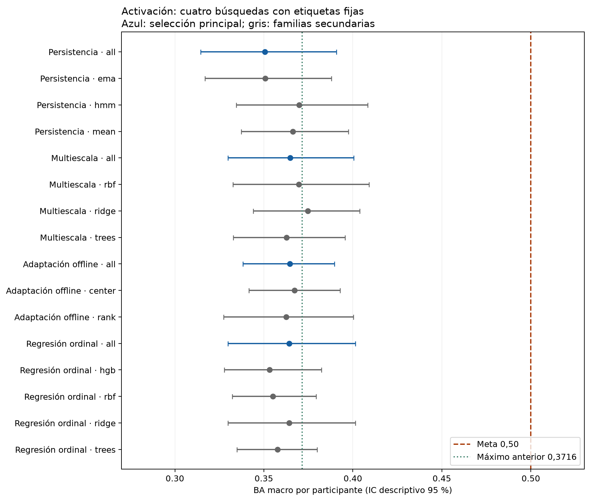

# Búsqueda de BA macro sobre 0,50: 12-09-2026

**Meta no alcanzada.** Máximo observado de estas rondas:
0.3747, Multiescala / ridge. Es un contraste secundario.
La referencia previa era 0,3716, también secundaria. El resultado no demuestra que
0,50 sea imposible ni confirma generalización independiente.

## Qué se probó

1. Persistencia: 16 filtros sobre el promedio fijo con historial. Media causal, EMA y
   Markov con transiciones aprendidas solo dentro de ajuste. 240 puntuaciones internas.
2. Multiescala: 24 configuraciones con Ridge, RBF y Extra Trees; señales actuales,
   estadísticas de 4/16/64 ventanas, desfase de cuatro ventanas y desviaciones relativas.
   360 ajustes internos y 1.080 puntuaciones con suavizado 1/8/32.
3. Adaptación offline: 60 reglas de centrado/rango por persona sin etiquetas; 900
   puntuaciones internas. Requiere la sesión completa y no sirve para afirmar desempeño
   causal o en tiempo real.
4. Regresión ordinal: 12 modelos base con Ridge, RBF, HGB y Extra Trees. Codificación
   -1/0/1, 18 reglas de umbral/suavizado, 180 ajustes internos y 3.240 puntuaciones.

Todas mantienen arousal_label_6s y EEG + mirada + pupila como entradas. GSR no entra
al estudiante. La regresión cambia la función de entrenamiento, no la etiqueta evaluada.
Cinco folds externos por participante dentro de train y tres internos. Se congelan
las elecciones antes de evaluar cada ronda externamente. No se reevaluaron validation/test.

## Comparación completa

| round | scope | primary | BA_macro | BA_global | macro_F1 |
|---|---|---|---|---|---|
| Persistencia | all | True | 0.3506 | 0.3575 | 0.3571 |
| Persistencia | ema | False | 0.3508 | 0.3623 | 0.3497 |
| Persistencia | hmm | False | 0.3698 | 0.3621 | 0.3521 |
| Persistencia | mean | False | 0.3662 | 0.3663 | 0.3658 |
| Multiescala | all | True | 0.3649 | 0.3565 | 0.3476 |
| Multiescala | rbf | False | 0.3696 | 0.3590 | 0.3472 |
| Multiescala | ridge | False | 0.3747 | 0.3693 | 0.3646 |
| Multiescala | trees | False | 0.3628 | 0.3428 | 0.2926 |
| Adaptación offline | all | True | 0.3645 | 0.3637 | 0.3520 |
| Adaptación offline | center | False | 0.3672 | 0.3654 | 0.3442 |
| Adaptación offline | rank | False | 0.3626 | 0.3577 | 0.3558 |
| Regresión ordinal | all | True | 0.3642 | 0.3542 | 0.3457 |
| Regresión ordinal | hgb | False | 0.3532 | 0.3474 | 0.3438 |
| Regresión ordinal | rbf | False | 0.3551 | 0.3464 | 0.3402 |
| Regresión ordinal | ridge | False | 0.3642 | 0.3542 | 0.3457 |
| Regresión ordinal | trees | False | 0.3576 | 0.3575 | 0.3558 |

Los IC de la figura son descriptivos: 2.000 remuestreos por participante, tras promediar
semillas. No corrigen selección adaptativa ni dependencia entre folds. Se han probado
muchos enfoques sobre las mismas 25 personas: escoger retrospectivamente el máximo
es una exploración, no evidencia de superioridad confirmada. No se cambia BA macro por
accuracy, por la métrica de un fold favorable ni por una clasificación binaria.

## Hallazgos de auditoría

- El mejor Ridge multiescala da 0,37475 frente a 0,37160: +0,315 puntos porcentuales,
  IC pareado [-2,262; +2,770], mejora en 14/25 personas. La selección conjunta da 0,36485.
- Su recall medio es 0,2327; bajo, 0,4995; alto, 0,3758. La mezcla anterior tenía recall
  medio 0,2881. Una BA mayor puede ocultar un intercambio desfavorable entre clases.
- Las etiquetas originales usan cuantiles por persona. Un mismo Arousal Score puede
  corresponder a clases diferentes entre personas; no se usa un umbral global inventado
  para reinterpretarlas. Fuente: scripts/preparar_modelado.py, función ternary y aplicación
  por participante. Este diagnóstico no altera el diseño ya validado.
- La igualdad exacta de scores detuvo el primer intento multiescala con diferencias
  de 1,67e-16. Se conserva completo en multiescala_11-09-2026; la continuación reutiliza
  idénticas elecciones y predicciones internas, y repite solo ajustes externos. Tolera
  rtol=atol=1e-12 en scores, exigiendo clases idénticas. La diferencia máxima en la
  continuación fue 4,94e-13. El escalado reajustado se verifica con esa misma tolerancia
  relativa/absoluta; sus unidades pueden producir diferencias absolutas mayores.
- La regresión ordinal se detuvo también en RBF con diferencia de 2,83e-11. Se comprobó
  que las variables eran exactamente iguales y que el origen era la disposición en
  memoria. Con entradas C-contiguas la diferencia fue cero; se conserva la tolerancia
  1e-12 y se repiten solo ajustes externos. La continuación mantiene los 180 ajustes
  internos y umbrales congelados. Se guarda también el intento ordinal parcial.
- Una prueba de dependencia futura de la adaptación usaba un umbral que no cruzaba
  con el ejemplo; se corrigió el ejemplo antes de entrenar. Las 56 pruebas finales pasan.
  Joblib emite advertencias de deprecación de NumPy al recargar; las comprobaciones pasan.

## Artefactos y reproducción

100 archivos de modelos completos recargados; 270,480 predicciones
verificadas; 5,460 puntuaciones internas recalculadas. Se conservan además
los modelos del intento parcial, que no se cuentan como una ronda externa completa.
540 ajustes internos nuevos en los dos enfoques que entrenan clasificadores/regresores.
Los filtros reutilizan modelos base auditados. Los informes individuales detallan
configuraciones, métricas por clase/persona, intervalos y comandos.

Multiescala completa: scripts/continuar_multiescala.py; auditoría:
scripts/continuar_multiescala.py --audit. El script original reproduce también el intento
interrumpido; no debe ejecutarse encima de los artefactos existentes. Los originales
permanecen conservados y el manifiesto continuacion.json explica la corrección.
Regresión ordinal completa y predictor canónico: scripts/continuar_regresion_ordinal.py;
auditoría: scripts/continuar_regresion_ordinal.py --audit. Para cargar los modelos usar
continuar_regresion_ordinal.predict(bundle, frame); el controlador de auditoría utiliza
ese mismo predictor y verifica además el inventario y las elecciones de la fuente parcial.

Reproducir las otras rondas con sus scripts entrenar_* y auditar_* indicados en los
informes. Para regenerar este resumen, usar scripts/informe_meta_05.py en una copia sin
el directorio meta_05_12-09-2026 existente. Pesos, predicciones, selecciones, hashes y
protocolos se conservan en resultados. La normalización original sigue siendo offline.

## Qué implica no llegar a 0,50

Estas búsquedas no respaldan prometer 0,50 mediante más ajuste de hiperparámetros. El
desempeño puede estar limitado por la relación entre señales del estudiante y la
pseudoetiqueta GSR, la variación entre personas o la calidad/sincronización. Son hipótesis
pendientes de comprobar, no causas demostradas. El siguiente paso con valor metodológico
es auditar esas relaciones y la calidad temporal antes de ampliar otra grilla; cualquier
cambio futuro de etiqueta requeriría un experimento separado y dejaría de ser comparable.

Informes: [persistencia](Busqueda_persistencia_11-09-2026.md),
[multiescala](Busqueda_multiescala_11-09-2026.md),
[adaptación offline](Busqueda_adaptacion_11-09-2026.md),
[regresión ordinal](Regresion_Ordinal_12-09-2026.md).
