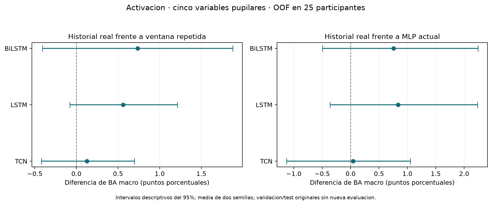

# Control del historial pupilar: 08-09-2026

Este contraste complementa [los modelos temporales del 07-09-2026](Modelos_Temporales_07-09-2026.md).
Evalúa el aporte de hasta ocho ventanas de historia para predecir activación con las mismas
cinco variables. Los datos de validación y prueba originales no se vuelven a evaluar.
Es un seguimiento exploratorio motivado por resultados ya observados; la separación interna
evita que las etiquetas de cada participante evaluado seleccionen la época de su modelo,
pero no convierte la hipótesis elegida previamente en una confirmación independiente.

## Lectura de los resultados

La logística con cinco variables obtiene BA macro 0.3536, frente a
0.3534 de LSTM y 0.3526
de BiLSTM con historial. El MLP comparable obtiene 0.3451.
Las recurrentes mejoran puntualmente frente al MLP, pero sus intervalos pareados incluyen
cero y no superan a logística en promedio. La referencia estática elegida cambia la lectura:
LSTM sí supera a Random Forest en este contraste descriptivo, aunque eso no demuestra
superioridad frente a los controles de ventana actual en general.

Frente a la misma arquitectura entrenada con ventana actual repetida:

- TCN: +0.12 puntos porcentuales; intervalo [-0.42; +0.70]; mejora en 14/25 participantes.
- LSTM: +0.56 puntos porcentuales; intervalo [-0.08; +1.21]; mejora en 17/25 participantes.
- BiLSTM: +0.74 puntos porcentuales; intervalo [-0.41; +1.88]; mejora en 16/25 participantes.

Los tres intervalos incluyen cero. Hay una señal pequeña favorable al historial en
clasificación, con variación entre personas; este resultado no establece una mejora estable.
En regresión, todas las redes con historial tienen R² negativo cercano a cero y mayor MSE
medio por participante que sus controles repetidos. La clasificación ordinal es por ahora
el contraste más informativo, sin descartar futuras formulaciones del score continuo.

Para acotar el trabajo, estos resultados sostienen conservar el panel pupilar de cinco
variables, logística como referencia compacta y MLP como control neuronal. El panel es
experimental: no se ha demostrado que sea suficiente para predecir activación con utilidad
práctica. La importancia previa de `pupil_std_z` sigue siendo dependencia del modelo;
este control no demuestra que su variación histórica explique una ganancia reproducible.
Mantener etiquetas y registrar el siguiente protocolo de contexto/fusión antes de evaluarlo.

## Diseño ejecutado

- Entradas fijas: `pupil_mean_z`, `pupil_std_z`, `pupil_min_z`, `pupil_max_z`, `pupil_slope_z_s`.
- Etiquetas originales: `arousal_label_6s` y `arousal_score_6s`, construidas desde GSR.
  GSR no entra al estudiante. No se modifican etiquetas, exclusiones ni split 25/8/8.
- Cinco folds externos por participante dentro de train: 20 para ajustar, cinco para evaluar.
  De los 20, una partición interna 16/4 elige época; luego se reinicia la red y se ajusta
  con los 20 durante ese número de épocas. Cada participante tiene predicciones OOF una vez
  por configuración y semilla. Se conservan los folds del protocolo de estabilidad.
- Imputación por mediana con indicadores de ausencias y escalado ajustados separadamente
  en inner16 y outer20. Las columnas originales heredan normalización offline por participante.
- TCN, LSTM y BiLSTM con historial real frente a la misma arquitectura entrenada con
  cada vector pasado reemplazado por la ventana actual. Ambas conservan longitud, padding,
  parámetros e inicialización por semilla. Las épocas pueden diferir porque cada configuración
  sigue la misma regla de selección interna. Se estima el aporte de la información histórica
  bajo este procedimiento, no un efecto causal ni únicamente el efecto del orden temporal.
- MLP con las mismas cinco variables y acceso solo al endpoint; Dummy, logística/Ridge
  y Random Forest estáticos con esas mismas entradas y los mismos participantes externos.
- Dos semillas neuronales, 20260907 y 20260908. Baselines con semilla 20260907, RF de 200 árboles.
  Hiperparámetros neuronales del protocolo anterior: 24 unidades, dropout 0,2, AdamW 0,001,
  máximo 30 épocas, paciencia 6, mínimo 8 antes de detener, batches de 256 y clipping 1.
  La mejor época puede ser anterior a ocho; ocho limita cuándo detener la búsqueda.
  La pérdida se promedia por ventana; clasificación usa pesos de clase calculados en ajuste.
  La métrica de selección da igual peso a cada participante de validación interna.

La separación entre selección interna y evaluación externa sigue el principio descrito
en la [documentación de validación anidada de scikit-learn](https://scikit-learn.org/stable/auto_examples/model_selection/plot_nested_cross_validation_iris.html).
Los grupos de evaluación son disjuntos de los de ajuste mediante
[GroupKFold](https://scikit-learn.org/stable/modules/generated/sklearn.model_selection.GroupKFold.html).
Se usa un holdout interno por fold, no una búsqueda exhaustiva de hiperparámetros.

## Clasificación

Métrica principal: balanced accuracy calculada por participante y luego promediada entre
participantes y semillas. BA global agrupa todas las ventanas OOF por semilla y después
promedia semillas. No es un ensemble de probabilidades.

| architecture | mode | macro_score | balanced_accuracy | seeds |
|---|---|---|---|---|
| BiLSTM | history | 0.3526 | 0.3497 | 2 |
| BiLSTM | repeat_current | 0.3453 | 0.3437 | 2 |
| LSTM | history | 0.3534 | 0.3447 | 2 |
| LSTM | repeat_current | 0.3478 | 0.3381 | 2 |
| MLP_current | current | 0.3451 | 0.3477 | 2 |
| TCN | history | 0.3455 | 0.3500 | 2 |
| TCN | repeat_current | 0.3443 | 0.3488 | 2 |
| dummy_prior | current | 0.3467 | 0.3333 | 1 |
| logistic | current | 0.3536 | 0.3530 | 1 |
| random_forest | current | 0.3371 | 0.3350 | 1 |

Dummy puede diferir de 1/3 en la métrica macro: se promedian recalls de las clases observadas
en cada persona, como en el protocolo previo; dos participantes de train tienen dos clases.
La BA global mantiene la referencia de tres clases. Usar el Dummy observado al comparar.

## Aporte del historial

Diferencia positiva favorece el historial real. Intervalos descriptivos de percentiles:
2.000 remuestreos pareados de los 25 participantes, después de promediar semillas.
No corrigen múltiples contrastes ni incorporan la dependencia por solapamiento de los
conjuntos de ajuste entre folds; no son pruebas confirmatorias de significación.
La selección de época con cuatro personas y solo dos semillas deja variación de ajuste
que estos intervalos no resumen por completo.

| architecture | reference | reference_mode | mean_delta | ci_low | ci_high | positive_participants |
|---|---|---|---|---|---|---|
| TCN | TCN | repeat_current | 0.0012 | -0.0042 | 0.0070 | 14 |
| TCN | MLP_current | current | 0.0004 | -0.0113 | 0.0105 | 14 |
| LSTM | LSTM | repeat_current | 0.0056 | -0.0008 | 0.0121 | 17 |
| LSTM | MLP_current | current | 0.0084 | -0.0036 | 0.0223 | 12 |
| BiLSTM | BiLSTM | repeat_current | 0.0074 | -0.0041 | 0.0188 | 16 |
| BiLSTM | MLP_current | current | 0.0076 | -0.0050 | 0.0224 | 13 |



## Score continuo

`macro_score` es MSE negativo promediado por participante; una diferencia positiva indica
menor error. R², MSE y MAE agrupan las predicciones OOF por semilla y luego se promedian.

| architecture | mode | macro_score | r2 | mse | mae |
|---|---|---|---|---|---|
| BiLSTM | history | -1.0008 | -0.0010 | 1.0010 | 0.6341 |
| BiLSTM | repeat_current | -1.0007 | -0.0009 | 1.0009 | 0.6332 |
| LSTM | history | -1.0039 | -0.0039 | 1.0039 | 0.6348 |
| LSTM | repeat_current | -1.0016 | -0.0017 | 1.0017 | 0.6331 |
| MLP_current | current | -1.0005 | -0.0006 | 1.0006 | 0.6321 |
| TCN | history | -1.0031 | -0.0034 | 1.0034 | 0.6340 |
| TCN | repeat_current | -1.0017 | -0.0017 | 1.0017 | 0.6314 |
| dummy_mean | current | -1.0000 | 0.0000 | 1.0000 | 0.6320 |
| random_forest | current | -1.0405 | -0.0407 | 1.0407 | 0.6600 |
| ridge | current | -1.0000 | -0.0000 | 1.0000 | 0.6323 |

## Cobertura y alcance

Se evalúan 13,524 ventanas de 25 participantes.
Historial medio: 4.89 ventanas; solo 33.1%
dispone de ocho ventanas y 16.9% tiene únicamente la actual.
Cada secuencia reinicia ante cambio de participante, grabación, segmento, estímulo o hueco.
Máximo soporte de 9 s, con ventanas de 2 s y stride de 1 s. BiLSTM recorre solamente
el pasado y la ventana actual. Los controles repetidos retienen la longitud como información
potencial; la comparación con MLP puede incluir su efecto. No se aísla orden frente a
promediado/suavizado del pasado. No se reestima aquí la importancia individual de variables.
La ausencia de `pupil_both_valid_fraction` no elimina toda posible información de calidad:
los indicadores de valores ausentes permanecen en el preprocesador.

Las pseudoetiquetas y la normalización por sesión son offline. No se afirma validación en
tiempo real, desempeño sobre etiquetas humanas ni confirmación de toda la hipótesis multimodal.
Este experimento se limita a activación y pupila; no incluye atención ni nuevas fusiones.

## Artefactos y reproducción

Se guardan **170 modelos externos evaluados: 140 redes y 30 pipelines estáticos**, diez
preprocesadores, 140 historiales de búsqueda interna/reajuste, metadatos con hashes y
459.816 predicciones OOF con probabilidades de clasificación. Hubo 140 ajustes neuronales
internos adicionales para seleccionar época; sus curvas están guardadas, no sus pesos.
Cada modelo externo usa 20 participantes. No hay un nuevo modelo final ajustado con los 25.

En [resultados](../resultados/control_historial_08-09-2026/): `protocolo.json`,
`catalogo_modelos.json`, `modelos/`, `predicciones/`, `historiales/`, `resumen_oof.csv`,
`metricas_oof_por_semilla.csv`, `metricas_folds.csv`, `metricas_participantes.csv`,
`ganancias_pareadas.csv`, `ganancias_por_participante.csv`, `secuencias_train_oof.csv.gz`,
`verificacion_entrega.json` y figuras PNG/PDF. La auditoría recarga todos los modelos,
reproduce predicciones, verifica cobertura y recalcula métricas de folds y participantes.

```powershell
python -m pip install -r requirements_temporales.txt
python -m unittest discover -s tests
python scripts/control_historial.py --output resultados/NUEVA_EJECUCION
python scripts/informe_control_historial.py --output resultados/NUEVA_EJECUCION
```

El directorio de entrenamiento debe ser nuevo. El informe se regenera sin entrenar y
exige los hashes originales. Consultar `COMO_CARGAR.md` en resultados para recuperar un modelo.
