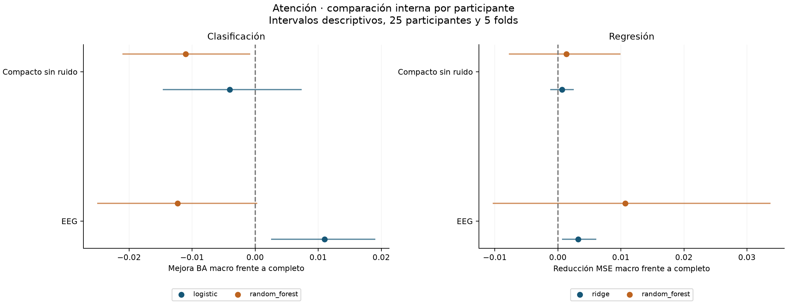
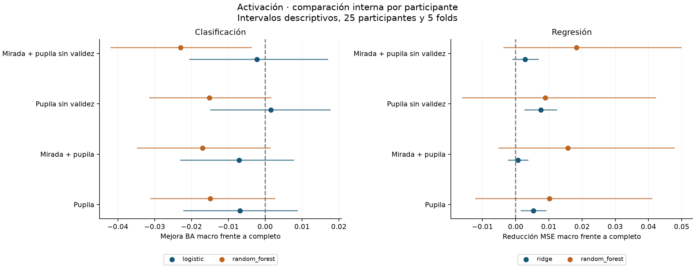

# Estabilidad de la reduccion de variables — 07-09-2026

> Complementa el análisis exploratorio de importancia y lo reemplaza como fuente vigente para el panel de entradas del siguiente experimento. No confirma un ganador universal.

## Conclusión y decisión

**La mejora inicial de activación con pupila sola no se sostuvo en el contraste interno.** En BA macro por participante, RF completo obtiene 0,3538 y pupila sola 0,3389; logística completa obtiene 0,3520 y pupila sola 0,3452. La logística con cinco variables pupilares sin validez alcanza 0,3536, pero la diferencia frente al completo incluye cero en su intervalo descriptivo. Se conserva como candidato pequeño, no como ganador confirmado.

**En atención, seleccionar las mismas columnas no garantiza conservar desempeño.** RF completo obtiene 0,3492 y el compacto de nueve entradas 0,3382. La diferencia compactado − completo es -0,0110 con intervalo [-0,0211; -0,0008]. La selección elimina ruido eléctrico y redundancias a la vez; no permite atribuir la diferencia exclusivamente a una de esas intervenciones.

Logística con EEG solo es el contraste reducido más favorable de clasificación de atención (0,3445). Ese conjunto conserva el indicador de ruido eléctrico del baseline y no constituye una selección fisiológica limpia. La señal es pequeña y los intervalos son exploratorios.

Para el score continuo de activación, Ridge con cinco variables pupilares obtiene MSE macro 1,0000, prácticamente el 1,0000 del predictor de la media. Los RF de regresión son peores que ese predictor en todos los conjuntos. La reducción no resuelve todavía la predicción del score.

Decisión operativa: mantener los completos de 18/25 entradas como referencia y dejar congelados los contrastes reducidos de este informe. Para activación, priorizar el candidato mínimo de pupila sin validez (5), contrastándolo con pupila (6), mirada + pupila (16) y completo (25); la variante de 15 columnas es un control adicional de calidad. Para atención, comparar completo (18), EEG (9) y compacto sin ruido (9). No se elimina una modalidad del diseño general ni se fija un único ganador para todas las tareas/modelos.

## Ejecución realizada

Se ajustaron **180 modelos internos** y **36 pipelines finales**. Se mantuvieron las pseudoetiquetas principales, el contexto GSR de 6 s y el split congelado. El test no se evaluó. Los pipelines finales se entrenaron con los 25 participantes de train y se verificaron tras recargarlos, incluidas probabilidades de clasificación.

El panel se fijó por su función experimental: referencia completa, reducción por modalidad, reducción de redundancia y contraste de calidad. No se eligió el máximo de validación como ganador. Las columnas exactas quedaron registradas antes de calcular las métricas finales de validación en `conjuntos_congelados.json`.

## Protocolo y alcance

Cinco folds GroupKFold, con semilla 20260907, repartieron los 25 participantes de train. Cada ajuste usó 20 participantes y predijo los 5 restantes; cada participante recibió una predicción fuera de fold. Sus ventanas completas permanecieron juntas. Las 13.524 ventanas de train se evaluaron una vez por configuración, con igual peso por participante en el resumen principal.

Se compararon logística/Ridge y Random Forest, junto con DummyClassifier/DummyRegressor. RF mantuvo 200 árboles, hoja mínima de 5 y semilla 20260822; logística conservó balance de clases y Ridge alpha=1. Se usaron cuatro trabajadores para los árboles. Imputación, indicadores de ausencia y escalado se ajustaron de nuevo dentro de cada fold.

Para atención, el candidato compacto excluye `eeg_line_noise_ratio`. Un recorrido con prioridad explícita conserva una entrada si no tiene correlación absoluta de Spearman ≥0,90 con otra ya conservada. También excluye constantes o columnas sin observaciones. Las correlaciones se calculan exclusivamente en los 20 participantes de ajuste de cada fold. Se priorizan RMS para amplitud EEG y componente tónica para nivel GSR; la lista completa está en `protocolo.json`. No se usaron las etiquetas para ordenar entradas.

Para activación se comparan 25 entradas completas, pupila (6), mirada + pupila (16), pupila sin fracción de validez binocular (5) y mirada + pupila sin esa fracción (15). “Sin validez” retira esa columna explícita; el imputador mantiene indicadores de ausencia. Por tanto no elimina toda posible información de calidad de adquisición.

Se calculan balanced accuracy macro por participante para clasificación y MSE macro para regresión. La BA de cada participante promedia el recall de las clases presentes en sus datos, siguiendo la métrica anterior. Si falta una clase, el Dummy macro puede diferir de 1/3; por eso se compara con el Dummy realmente ajustado en cada fold. Los intervalos de las diferencias provienen de 2.000 remuestreos pareados de los 25 participantes. Son descriptivos: los modelos comparten sujetos de ajuste entre folds, solo se ejecutó una partición de cinco folds y no se corrige por comparaciones múltiples. No son una prueba confirmatoria ni de no inferioridad.

Las hipótesis de subconjuntos proceden del análisis previo que ya observó train y validación. Este contraste examina sensibilidad interna y no constituye evidencia independiente. Además, se hereda normalización por participante offline, incluidas las pseudoetiquetas; no es una evaluación de inferencia causal en tiempo real.

## Resultados internos por participante

Δ completo y Δ trivial son mejoras: positivas significan mejor desempeño. En clasificación son diferencias de balanced accuracy; en regresión son reducciones del MSE. El valor de MSE mostrado en la tabla es positivo. “Folds mejores” cuenta en cuántos de los cinco folds mejora al mismo modelo completo. Un intervalo que cruza cero no demuestra equivalencia.

### Atención: clasificación

| Modelo | Conjunto | Variables medias | BA macro | Δ completo | Intervalo 95 % | Δ trivial | Intervalo 95 % | Folds mejores |
| --- | --- | --- | --- | --- | --- | --- | --- | --- |
| dummy | Completo | 18 | 0,3333 | 0,0000 | [0,0000; 0,0000] | 0,0000 | [0,0000; 0,0000] | 0/5 |
| logistic | EEG | 9 | 0,3445 | 0,0110 | [0,0026; 0,0190] | 0,0112 | [0,0009; 0,0219] | 5/5 |
| logistic | Compacto sin ruido | 9 | 0,3295 | -0,0040 | [-0,0146; 0,0074] | -0,0039 | [-0,0186; 0,0096] | 2/5 |
| logistic | Completo | 18 | 0,3335 | 0,0000 | [0,0000; 0,0000] | 0,0002 | [-0,0106; 0,0116] | 0/5 |
| random_forest | EEG | 9 | 0,3369 | -0,0123 | [-0,0250; 0,0004] | 0,0035 | [-0,0048; 0,0112] | 1/5 |
| random_forest | Compacto sin ruido | 9 | 0,3382 | -0,0110 | [-0,0211; -0,0008] | 0,0048 | [-0,0045; 0,0142] | 1/5 |
| random_forest | Completo | 18 | 0,3492 | 0,0000 | [0,0000; 0,0000] | 0,0158 | [0,0072; 0,0239] | 0/5 |

### Atención: regresión

| Modelo | Conjunto | Variables medias | MSE macro | Δ completo | Intervalo 95 % | Δ trivial | Intervalo 95 % | Folds mejores |
| --- | --- | --- | --- | --- | --- | --- | --- | --- |
| dummy | Completo | 18 | 1,0000 | 0,0000 | [0,0000; 0,0000] | 0,0000 | [0,0000; 0,0000] | 0/5 |
| random_forest | EEG | 9 | 1,0484 | 0,0107 | [-0,0103; 0,0338] | -0,0484 | [-0,0599; -0,0383] | 3/5 |
| random_forest | Compacto sin ruido | 9 | 1,0578 | 0,0013 | [-0,0078; 0,0099] | -0,0578 | [-0,0740; -0,0421] | 2/5 |
| random_forest | Completo | 18 | 1,0591 | 0,0000 | [0,0000; 0,0000] | -0,0591 | [-0,0747; -0,0449] | 0/5 |
| ridge | EEG | 9 | 1,0037 | 0,0032 | [0,0007; 0,0061] | -0,0037 | [-0,0080; -0,0001] | 4/5 |
| ridge | Compacto sin ruido | 9 | 1,0063 | 0,0006 | [-0,0012; 0,0025] | -0,0063 | [-0,0117; -0,0013] | 3/5 |
| ridge | Completo | 18 | 1,0069 | 0,0000 | [0,0000; 0,0000] | -0,0069 | [-0,0118; -0,0020] | 0/5 |

### Activación: clasificación

| Modelo | Conjunto | Variables medias | BA macro | Δ completo | Intervalo 95 % | Δ trivial | Intervalo 95 % | Folds mejores |
| --- | --- | --- | --- | --- | --- | --- | --- | --- |
| dummy | Completo | 25 | 0,3467 | 0,0000 | [0,0000; 0,0000] | 0,0000 | [0,0000; 0,0000] | 0/5 |
| logistic | Pupila sin validez | 5 | 0,3536 | 0,0016 | [-0,0149; 0,0177] | 0,0069 | [-0,0221; 0,0329] | 2/5 |
| logistic | Pupila | 6 | 0,3452 | -0,0068 | [-0,0222; 0,0089] | -0,0015 | [-0,0296; 0,0260] | 2/5 |
| logistic | Mirada + pupila sin validez | 15 | 0,3498 | -0,0022 | [-0,0206; 0,0171] | 0,0031 | [-0,0288; 0,0343] | 3/5 |
| logistic | Mirada + pupila | 16 | 0,3449 | -0,0071 | [-0,0231; 0,0078] | -0,0018 | [-0,0317; 0,0282] | 1/5 |
| logistic | Completo | 25 | 0,3520 | 0,0000 | [0,0000; 0,0000] | 0,0053 | [-0,0152; 0,0271] | 0/5 |
| random_forest | Pupila sin validez | 5 | 0,3386 | -0,0152 | [-0,0315; 0,0017] | -0,0080 | [-0,0246; 0,0064] | 0/5 |
| random_forest | Pupila | 6 | 0,3389 | -0,0149 | [-0,0312; 0,0027] | -0,0078 | [-0,0242; 0,0081] | 1/5 |
| random_forest | Mirada + pupila sin validez | 15 | 0,3308 | -0,0229 | [-0,0420; -0,0036] | -0,0158 | [-0,0393; 0,0060] | 0/5 |
| random_forest | Mirada + pupila | 16 | 0,3368 | -0,0170 | [-0,0348; 0,0015] | -0,0099 | [-0,0339; 0,0121] | 1/5 |
| random_forest | Completo | 25 | 0,3538 | 0,0000 | [0,0000; 0,0000] | 0,0071 | [-0,0110; 0,0271] | 0/5 |

### Activación: regresión

| Modelo | Conjunto | Variables medias | MSE macro | Δ completo | Intervalo 95 % | Δ trivial | Intervalo 95 % | Folds mejores |
| --- | --- | --- | --- | --- | --- | --- | --- | --- |
| dummy | Completo | 25 | 1,0000 | 0,0000 | [0,0000; 0,0000] | 0,0000 | [0,0000; 0,0000] | 0/5 |
| random_forest | Pupila sin validez | 5 | 1,0410 | 0,0089 | [-0,0162; 0,0423] | -0,0410 | [-0,0488; -0,0329] | 3/5 |
| random_forest | Pupila | 6 | 1,0397 | 0,0102 | [-0,0122; 0,0411] | -0,0397 | [-0,0476; -0,0316] | 3/5 |
| random_forest | Mirada + pupila sin validez | 15 | 1,0316 | 0,0183 | [-0,0037; 0,0500] | -0,0316 | [-0,0405; -0,0229] | 4/5 |
| random_forest | Mirada + pupila | 16 | 1,0342 | 0,0157 | [-0,0052; 0,0480] | -0,0342 | [-0,0443; -0,0246] | 3/5 |
| random_forest | Completo | 25 | 1,0499 | 0,0000 | [0,0000; 0,0000] | -0,0499 | [-0,0812; -0,0266] | 0/5 |
| ridge | Pupila sin validez | 5 | 1,0000 | 0,0075 | [0,0027; 0,0125] | 0,0000 | [-0,0016; 0,0017] | 5/5 |
| ridge | Pupila | 6 | 1,0021 | 0,0054 | [0,0015; 0,0093] | -0,0021 | [-0,0062; 0,0015] | 5/5 |
| ridge | Mirada + pupila sin validez | 15 | 1,0047 | 0,0028 | [-0,0010; 0,0069] | -0,0047 | [-0,0085; -0,0013] | 5/5 |
| ridge | Mirada + pupila | 16 | 1,0068 | 0,0007 | [-0,0023; 0,0039] | -0,0068 | [-0,0122; -0,0018] | 3/5 |
| ridge | Completo | 25 | 1,0075 | 0,0000 | [0,0000; 0,0000] | -0,0075 | [-0,0129; -0,0021] | 0/5 |

## Estabilidad de columnas compactas de atención

Conjuntos por fold: [9, 9, 9, 9, 9]. Similitud Jaccard media entre pares: 0.880; mínima: 0.800. Esta estabilidad mide selección por redundancia, no relevancia causal ni predictiva.

| Variable | Folds seleccionada | Conjunto final |
| --- | --- | --- |
| eeg_rms_uv | 5/5 | Sí |
| eeg_alpha_relative | 5/5 | Sí |
| eeg_theta_relative | 5/5 | Sí |
| eeg_beta_relative | 3/5 | Sí |
| eeg_gamma_relative | 2/5 | No |
| eeg_delta_relative | 0/5 | No |
| eeg_std_uv | 0/5 | No |
| eeg_peak_to_peak_uv | 0/5 | No |
| gsr_tonic_mean_z | 5/5 | Sí |
| gsr_phasic_mean_z | 5/5 | Sí |
| gsr_slope_z_s | 5/5 | Sí |
| gsr_std_z | 5/5 | Sí |
| gsr_scr_count | 5/5 | Sí |
| gsr_scr_mean_prominence_z | 0/5 | No |
| gsr_mean_z | 0/5 | No |
| gsr_min_z | 0/5 | No |
| gsr_max_z | 0/5 | No |

## Panel congelado para el siguiente experimento

### Atención

| Conjunto | N | Columnas exactas |
| --- | --- | --- |
| Completo | 18 | `eeg_rms_uv`, `eeg_std_uv`, `eeg_peak_to_peak_uv`, `eeg_delta_relative`, `eeg_theta_relative`, `eeg_alpha_relative`, `eeg_beta_relative`, `eeg_gamma_relative`, `eeg_line_noise_ratio`, `gsr_mean_z`, `gsr_std_z`, `gsr_min_z`, `gsr_max_z`, `gsr_tonic_mean_z`, `gsr_phasic_mean_z`, `gsr_slope_z_s`, `gsr_scr_count`, `gsr_scr_mean_prominence_z` |
| EEG | 9 | `eeg_rms_uv`, `eeg_std_uv`, `eeg_peak_to_peak_uv`, `eeg_delta_relative`, `eeg_theta_relative`, `eeg_alpha_relative`, `eeg_beta_relative`, `eeg_gamma_relative`, `eeg_line_noise_ratio` |
| Compacto sin ruido | 9 | `eeg_rms_uv`, `eeg_alpha_relative`, `eeg_theta_relative`, `eeg_beta_relative`, `gsr_tonic_mean_z`, `gsr_phasic_mean_z`, `gsr_slope_z_s`, `gsr_std_z`, `gsr_scr_count` |

### Activación

| Conjunto | N | Columnas exactas |
| --- | --- | --- |
| Completo | 25 | `eeg_rms_uv`, `eeg_std_uv`, `eeg_peak_to_peak_uv`, `eeg_delta_relative`, `eeg_theta_relative`, `eeg_alpha_relative`, `eeg_beta_relative`, `eeg_gamma_relative`, `eeg_line_noise_ratio`, `gaze_dispersion_x_px`, `gaze_dispersion_y_px`, `gaze_dispersion_2d_px`, `gaze_path_length_px`, `fixation_count`, `fixation_total_ms`, `fixation_mean_ms`, `fixation_median_ms`, `saccade_count`, `saccade_mean_ms`, `pupil_both_valid_fraction`, `pupil_mean_z`, `pupil_std_z`, `pupil_min_z`, `pupil_max_z`, `pupil_slope_z_s` |
| Pupila | 6 | `pupil_both_valid_fraction`, `pupil_mean_z`, `pupil_std_z`, `pupil_min_z`, `pupil_max_z`, `pupil_slope_z_s` |
| Mirada + pupila | 16 | `gaze_dispersion_x_px`, `gaze_dispersion_y_px`, `gaze_dispersion_2d_px`, `gaze_path_length_px`, `fixation_count`, `fixation_total_ms`, `fixation_mean_ms`, `fixation_median_ms`, `saccade_count`, `saccade_mean_ms`, `pupil_both_valid_fraction`, `pupil_mean_z`, `pupil_std_z`, `pupil_min_z`, `pupil_max_z`, `pupil_slope_z_s` |
| Pupila sin validez | 5 | `pupil_mean_z`, `pupil_std_z`, `pupil_min_z`, `pupil_max_z`, `pupil_slope_z_s` |
| Mirada + pupila sin validez | 15 | `gaze_dispersion_x_px`, `gaze_dispersion_y_px`, `gaze_dispersion_2d_px`, `gaze_path_length_px`, `fixation_count`, `fixation_total_ms`, `fixation_mean_ms`, `fixation_median_ms`, `saccade_count`, `saccade_mean_ms`, `pupil_mean_z`, `pupil_std_z`, `pupil_min_z`, `pupil_max_z`, `pupil_slope_z_s` |

Los conjuntos completos son controles. Los subconjuntos sirven para estudiar modalidad, redundancia y calidad; no se sustituye el protocolo original por una única selección. La reducción de entradas del estudiante no elimina sensores del profesor. No se entrenó TCN/LSTM en esta etapa.

## Validación del panel después de congelarlo

Estas métricas usan los ocho participantes de validación originales. Se reportan BA y R² globales, además del score macro en el CSV. No son test y no deben presentarse como validación externa independiente tras haber observado ese split antes.

### Atención

| Tarea | Modelo | Conjunto | N | BA / R² global |
| --- | --- | --- | --- | --- |
| classification | dummy_prior | Completo | 18 | 0,3333 |
| classification | logistic | Completo | 18 | 0,3357 |
| classification | logistic | EEG | 9 | 0,3383 |
| classification | logistic | Compacto sin ruido | 9 | 0,3387 |
| classification | random_forest | Completo | 18 | 0,3199 |
| classification | random_forest | EEG | 9 | 0,3259 |
| classification | random_forest | Compacto sin ruido | 9 | 0,3198 |
| regression | dummy_mean | Completo | 18 | 0,0000 |
| regression | ridge | Completo | 18 | -0,0001 |
| regression | ridge | EEG | 9 | -0,0004 |
| regression | ridge | Compacto sin ruido | 9 | 0,0002 |
| regression | random_forest | Completo | 18 | -0,0844 |
| regression | random_forest | EEG | 9 | -0,0430 |
| regression | random_forest | Compacto sin ruido | 9 | -0,0890 |

### Activación

| Tarea | Modelo | Conjunto | N | BA / R² global |
| --- | --- | --- | --- | --- |
| classification | dummy_prior | Completo | 25 | 0,3333 |
| classification | logistic | Completo | 25 | 0,3626 |
| classification | logistic | Pupila | 6 | 0,3713 |
| classification | logistic | Mirada + pupila | 16 | 0,3753 |
| classification | logistic | Pupila sin validez | 5 | 0,3776 |
| classification | logistic | Mirada + pupila sin validez | 15 | 0,3788 |
| classification | random_forest | Completo | 25 | 0,3243 |
| classification | random_forest | Pupila | 6 | 0,3563 |
| classification | random_forest | Mirada + pupila | 16 | 0,3526 |
| classification | random_forest | Pupila sin validez | 5 | 0,3458 |
| classification | random_forest | Mirada + pupila sin validez | 15 | 0,3504 |
| regression | dummy_mean | Completo | 25 | 0,0000 |
| regression | ridge | Completo | 25 | 0,0054 |
| regression | ridge | Pupila | 6 | 0,0023 |
| regression | ridge | Mirada + pupila | 16 | 0,0058 |
| regression | ridge | Pupila sin validez | 5 | 0,0027 |
| regression | ridge | Mirada + pupila sin validez | 15 | 0,0058 |
| regression | random_forest | Completo | 25 | -0,0352 |
| regression | random_forest | Pupila | 6 | -0,0395 |
| regression | random_forest | Mirada + pupila | 16 | -0,0214 |
| regression | random_forest | Pupila sin validez | 5 | -0,0413 |
| regression | random_forest | Mirada + pupila sin validez | 15 | -0,0147 |





## Archivos y reproducción

Desde la raíz del repositorio:

```powershell
python scripts/estabilidad_variables.py --output resultados/estabilidad_nueva_ejecucion --jobs 4
python -m unittest discover -s tests
```

La salida debe ser nueva. `scripts/informe_estabilidad.py` genera este informe y sus figuras para la ruta fechada de esta entrega; requiere Matplotlib 3.11.1 además de las dependencias de `requirements.txt`. Las tablas se generan directamente de los CSV.

- `protocolo.json`: reglas, semillas, versiones, hashes y participantes por fold.
- `seleccion_por_fold.json`: columnas y motivos de exclusión en cada ajuste.
- `estabilidad_seleccion.csv`: frecuencia de selección por columna.
- `metricas_folds.csv`, `metricas_participantes_oof.csv`, `resumen_cv.csv`: desempeño interno.
- `predicciones_oof.csv.gz`: predicciones fuera de fold, comprimidas sin pérdida.
- `conjuntos_congelados.json`: panel fijado antes de reportar validación.
- `validacion_panel_congelado.csv`: resultados finales de validación.
- `modelos_finales/` y `manifiesto.json`: pipelines completos, columnas y hashes.

Para cargar un pipeline propio: localizar su entrada en `manifiesto.json`, abrir con `joblib.load` y pasar las columnas de `features` en ese orden. Los modelos internos de cada fold se pueden reproducir con el protocolo; se guardan sus predicciones, no sus binarios.

## Verificación de entrega

Pasaron las 18 pruebas del repositorio. La auditoría independiente `python scripts/verificar_estabilidad.py` comprobó 486.864 predicciones fuera de fold, recalculó las 900 métricas por participante y verificó cobertura de cada participante, separación de folds y hashes de los 36 modelos finales. El detalle está en `verificacion_entrega.json`; la salida de pruebas, en `pruebas.txt`. Los modelos originales permanecen conservados y esta entrega está guardada localmente.

## Referencia metodológica

[GroupKFold, documentación oficial de scikit-learn](https://scikit-learn.org/stable/modules/generated/sklearn.model_selection.GroupKFold.html) describe particiones de grupos disjuntos. Aquí el grupo es el participante y se aplica exclusivamente al split train congelado.
