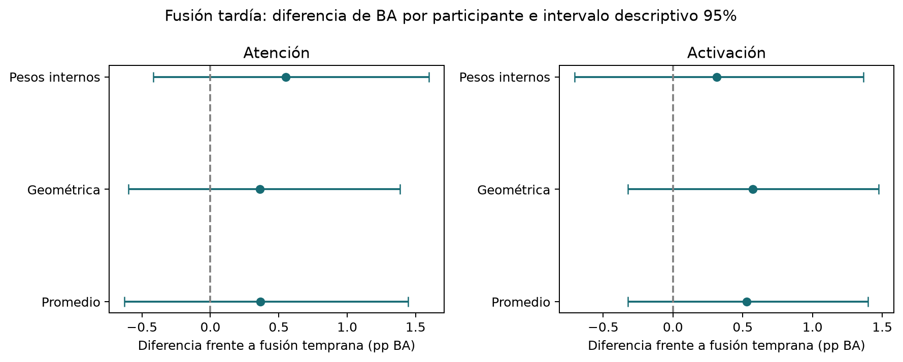

# Nuevos modelos y fusiones: 10-09-2026

Se probaron LDA regularizada y Extra Trees junto con logística, en clasificación de atención
y activación. Se registra cada ajuste, configuración y puntuación; los resultados desfavorables
se conservan. El contraste principal compara fusión tardía ponderada y temprana, con
selección interna de modelo/contexto en cada una.

- arousal: fusión ponderada +0.31 pp frente a temprana, intervalo [-0.71; +1.36], mejora en 12/25 personas.
- attention: fusión ponderada +0.55 pp frente a temprana, intervalo [-0.42; +1.60], mejora en 15/25 personas.

En activación, los mejores promedios observados corresponden a fusión geométrica (0,3651)
y media (0,3646). La geométrica gana 0,57 pp frente a temprana y 0,65 pp frente a logística
con las mismas 24 entradas; ambos intervalos incluyen cero. Frente a la logística pupilar
previa (0,3536), gana 1,15 pp, intervalo [-0,85; +3,31]. Es una señal favorable exploratoria,
sin superioridad estable confirmada. Elegir el máximo entre estrategias después de ver
estos resultados no equivale a una nueva validación independiente.

La selección interna diferencia las tareas: activación elige contexto de ocho ventanas
en todos los folds de fusión; en las fusiones tardías elige logística en tres folds y LDA
en dos. Atención elige Extra Trees con ventana actual en los cinco folds tardíos.
Su control unimodal (0,3450) queda prácticamente igual que la fusión ponderada (0,3444),
por lo que tampoco se demuestra una ventaja general de combinar modalidades para atención.

En activación, cuatro folds asignan peso 0,5 a pupila y 0,25 a mirada/EEG; uno asigna
0,5 a EEG. Estos son pesos seleccionados dentro de una grilla limitada, no contribuciones
causales ni porcentajes de varianza explicada. En atención, GSR recibe 0,75 en tres folds
y se usa reparto 0,5/0,5 en dos. Las selecciones sugieren qué contrastar después; no prueban
por sí mismas que un sensor o el historial sea necesario.

## Resultados OOF

| task | scope | macro_score | balanced_accuracy | macro_f1 |
|---|---|---|---|---|
| arousal | early | 0.3594 | 0.3629 | 0.3621 |
| arousal | fixed_logistic | 0.3586 | 0.3589 | 0.3566 |
| arousal | late_geometric | 0.3651 | 0.3651 | 0.3645 |
| arousal | late_mean | 0.3646 | 0.3648 | 0.3641 |
| arousal | late_weighted | 0.3625 | 0.3625 | 0.3620 |
| arousal | unimodal | 0.3475 | 0.3521 | 0.3510 |
| attention | early | 0.3389 | 0.3378 | 0.3192 |
| attention | fixed_logistic | 0.3335 | 0.3324 | 0.3278 |
| attention | late_geometric | 0.3425 | 0.3421 | 0.3303 |
| attention | late_mean | 0.3426 | 0.3421 | 0.3299 |
| attention | late_weighted | 0.3444 | 0.3442 | 0.3229 |
| attention | unimodal | 0.3450 | 0.3445 | 0.3120 |

BA macro promedia por participante y luego por semilla. BA global agrupa ventanas por
semilla y luego promedia métricas. Los estimadores deterministas pueden coincidir entre
semillas. `fixed_logistic` usa todas las entradas actuales permitidas: 18 para atención,
24 para activación; esta última referencia difiere de la logística pupilar de cinco
variables del experimento anterior. No confundir esos baselines.
`previous_pupil_logistic` conserva esa referencia pupilar de cinco variables, evaluada
en las mismas 25 personas y cinco folds, como comparación secundaria para activación.

| task | scope | reference | mean_delta | ci_low | ci_high | positive_participants |
|---|---|---|---|---|---|---|
| arousal | late_weighted | early | 0.0031 | -0.0071 | 0.0136 | 12 |
| arousal | late_weighted | fixed_logistic | 0.0040 | -0.0116 | 0.0204 | 13 |
| arousal | late_weighted | previous_pupil_logistic | 0.0089 | -0.0095 | 0.0279 | 14 |
| arousal | late_mean | early | 0.0053 | -0.0032 | 0.0140 | 15 |
| arousal | late_mean | fixed_logistic | 0.0061 | -0.0115 | 0.0238 | 12 |
| arousal | late_mean | previous_pupil_logistic | 0.0111 | -0.0079 | 0.0320 | 15 |
| arousal | late_geometric | early | 0.0057 | -0.0032 | 0.0148 | 16 |
| arousal | late_geometric | fixed_logistic | 0.0065 | -0.0115 | 0.0245 | 12 |
| arousal | late_geometric | previous_pupil_logistic | 0.0115 | -0.0085 | 0.0331 | 15 |
| arousal | unimodal | early | -0.0119 | -0.0304 | 0.0072 | 9 |
| arousal | unimodal | fixed_logistic | -0.0110 | -0.0255 | 0.0029 | 11 |
| arousal | unimodal | previous_pupil_logistic | -0.0061 | -0.0266 | 0.0155 | 11 |
| arousal | early | fixed_logistic | 0.0008 | -0.0156 | 0.0162 | 11 |
| arousal | early | previous_pupil_logistic | 0.0058 | -0.0132 | 0.0272 | 13 |
| attention | late_weighted | early | 0.0055 | -0.0042 | 0.0160 | 15 |
| attention | late_weighted | fixed_logistic | 0.0109 | -0.0053 | 0.0273 | 14 |
| attention | late_mean | early | 0.0036 | -0.0063 | 0.0144 | 13 |
| attention | late_mean | fixed_logistic | 0.0091 | -0.0078 | 0.0245 | 14 |
| attention | late_geometric | early | 0.0036 | -0.0060 | 0.0139 | 13 |
| attention | late_geometric | fixed_logistic | 0.0090 | -0.0074 | 0.0245 | 14 |
| attention | unimodal | early | 0.0061 | -0.0041 | 0.0169 | 15 |
| attention | unimodal | fixed_logistic | 0.0115 | -0.0075 | 0.0310 | 14 |
| attention | early | fixed_logistic | 0.0054 | -0.0094 | 0.0201 | 17 |



## Alternativas probadas

- Fusión temprana: concatenación de entradas antes de ajustar un modelo.
- Fusión tardía media: un modelo por modalidad y promedio de probabilidades.
- Fusión tardía geométrica: promedio de log-probabilidades, exponenciación y normalización.
  Se recortan probabilidades por debajo de 1e-12 para estabilidad numérica.
- Fusión tardía ponderada: pesos positivos en cuartos, suman uno y mantienen todas las
  modalidades. En atención: 0,25/0,75, 0,5/0,5, 0,75/0,25. En activación: permutaciones de
  0,5/0,25/0,25. Los pesos se eligen exclusivamente con datos internos.
- Control unimodal: modalidad, modelo y contexto elegidos internamente. Los bundles
  conservan todos los expertos, pero solo uno recibe peso uno; los demás pesan cero.
- Logística fija C=1, balanceada, con todas las entradas actuales, como referencia adicional.

Atención usa EEG (9) y GSR (9); eye tracking y pupila construyen la etiqueta y no entran.
Activación usa pupila (5, sin fracción de validez), mirada (10) y EEG (9); GSR construye
la etiqueta y no entra. Las features exactas y su orden se guardan en `protocolo.json`.

Tres familias: logística C=0,1 balanceada; LDA `lsqr`, shrinkage automático y priors uniformes;
Extra Trees con 100 árboles, profundidad máxima 8, mínimo 40 filas por hoja y clases
balanceadas. Imputación por mediana con indicadores de ausencia y escalado se ajustan
solo en personas de entrenamiento; cada experto tardío tiene su propio preprocesador.

Cada familia usa ventana actual o hasta ocho ventanas causales. Por modalidad se conservan
valores actuales, media, desviación estándar, diferencia con la ventana más antigua y
longitud disponible normalizada. El historial se reinicia ante huecos distintos de 1 s o
cambios de persona/grabación; puede atravesar estímulos. Soporte máximo de 9 s.
No se introducen etiquetas pasadas. La fusión temprana concatena una longitud por modalidad;
esas columnas coinciden y pueden influir en la regularización. No se afirma causalidad
fisiológica ni que una eventual ventaja de fusión demuestre una ventaja del historial.

## Selección y alcance

48 candidatos para atención y 54 para activación. Cinco folds externos dentro de train:
20 personas para ajustar y cinco para evaluar. Tres folds internos por cada conjunto de
20, promediando BA macro con igual peso por fold (seis o siete personas). Se selecciona
por separado cada estrategia, con desempate por identificador. Todas las selecciones de
ambas tareas se congelan antes de la primera evaluación externa. Reajuste con dos semillas,
20260910 y 20260911. No se elige entre estrategias usando su resultado externo.

Las búsquedas tienen distinto tamaño: temprana/media/geométrica evalúan seis candidatos
cada una; ponderada, 18; unimodal, 12 en atención y 18 en activación. Los intervalos no
corrigen ese conjunto de comparaciones. Se aplican 2.000 remuestreos pareados de personas,
después de promediar semillas; son descriptivos y no incorporan dependencia entre folds.
El train original ya se ha usado en iteraciones previas: esto es seguimiento exploratorio,
no confirmación con participantes nuevos. Validation y test originales no se vuelven a
evaluar. Se mantienen etiquetas y split; features y pseudoetiquetas son offline por persona.
No hay nueva regresión ni entrenamiento de TCN/LSTM en esta entrega.
Las probabilidades de los expertos no tienen una calibración externa adicional; su escala
y confianza pueden influir en las combinaciones aritméticas y geométricas.

## Registro y artefactos

La primera ejecución se interrumpió al exigir igualdad exacta de probabilidades tras
recargar Extra Trees con predicción paralela: diferencia máxima observada 2,22e-16.
Se conserva en `resultados/fusiones_10-09-2026/`, con `interrupcion.json`. La entrega
completa en `fusiones_10-09-2026_completa` reutiliza la búsqueda y las selecciones
congeladas; reajusta y evalúa los modelos externos con predicción en un solo hilo.
`reanudacion.json` registra la corrección y sus hashes. No se cambió una elección por
haber visto resultados externos. El wrapper reproducible fija un hilo desde el inicio.

- `bitacora.jsonl`: inicio/fin de cada grupo de ajustes, congelación y evaluación externa.
- `todos_los_intentos.csv`: 1.530 puntuaciones internas con modelo, contexto, estrategia,
  pesos y participantes. `busqueda_interna.csv` conserva el registro original.
- `selecciones.json`: 60 elecciones de estrategia/fold/tarea, incluida logística fija.
- `modelos/` y `catalogo_modelos.json`: 120 bundles con pipelines, modalidades, definición,
  participantes y hashes. Hubo 630 ajustes internos y
  240 ajustes de componentes externos. Se conservan las puntuaciones
  internas y los pesos de fusión elegidos; los estimadores de folds internos se descartan
  de memoria sin guardarlos como artefactos.
- `predicciones_oof.csv.gz`: 324,576 predicciones externas con probabilidades.
- Métricas por fold, participante y semilla; diferencias pareadas; figuras PNG/PDF.
- `verificacion.json`: recarga de los 120 bundles, reproducción de predicciones, auditoría
  de selecciones y recálculo de 120 métricas de fold y 600 de participante.
- `pruebas.txt`: pruebas de causalidad, mezcla de probabilidades y separación de modalidades.

```powershell
python -m unittest discover -s tests
python scripts/ejecutar_fusiones_estables.py --output resultados/NUEVA_FUSION
python scripts/informe_fusiones.py --output resultados/NUEVA_FUSION
```

Para cargar desde Python, añadir `scripts` al path, cargar un bundle con `joblib.load`
y llamar `explorar_fusiones.predict_bundle(bundle, frame)`. El frame debe estar ordenado
por participante, grabación y timestamp, con las columnas originales. No requiere etiquetas
para predecir. Cada bundle corresponde a un fold entrenado con 20 personas; no hay un
ajuste final nuevo sobre las 25. Las ejecuciones exigen una carpeta nueva.
