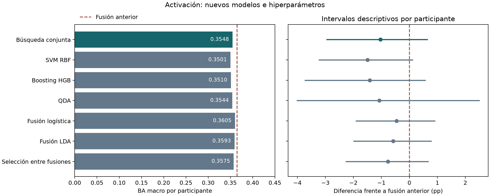

# Nuevos modelos e hiperparámetros: 11-09-2026

La búsqueda conjunta obtiene BA macro por participante **0.3548** y no supera la
fusión geométrica anterior, 0,3651. Diferencia: -1.03 puntos
porcentuales, intervalo descriptivo [-2.95; +0.63],
con mejora en 11/25 personas. Las reglas por familia son
contrastes secundarios: no se elige una retrospectivamente por su puntuación externa.

El intervalo incluye cero; la diferencia sigue siendo incierta.

## Modelos e hiperparámetros probados

| Familia | Grilla |
|---|---|
| SVM RBF exacta | C=0,1/1/10; gamma=0,1/d o 1/d, donde d es la dimensión transformada |
| Histogram Gradient Boosting | 7/15/31 hojas; perfil regular: tasa 0,03, 150 iteraciones, hoja mínima 100, L2=20; perfil flexible: tasa 0,1, 200 iteraciones, hoja mínima 30, L2=1 |
| QDA | regularización de covarianza 0,1/0,5/0,9; priors iguales |
| Fusión de logísticas | C=0,001/0,01/0,1/1; un modelo por modalidad, media geométrica igualitaria |
| Fusión de LDA | shrinkage=0,1/0,5/0,9; priors iguales y media geométrica igualitaria |

Cada configuración compara ventana actual y resumen causal de ocho ventanas. Se obtienen
44 configuraciones base; suavizar sus salidas en una o cuatro ventanas produce 88 decisiones.
Los perfiles de boosting son combinaciones predefinidas: no es un factorial completo de sus
cuatro hiperparámetros. No se aplica early stopping ni ajuste de umbrales por clase.

SVM y boosting usan pesos globales de clase; logística utiliza class_weight balanced.
QDA y LDA tienen priors uniformes. El balanceo por persona no se busca en esta ronda.
Imputación por mediana, indicadores de ausencia y escalado se ajustan solo en entrenamiento.
Cada modalidad de fusión tiene su propio preprocesador. Los modelos conjuntos reciben
las 24 variables de pupila, mirada y EEG. GSR no entra como predictor.

SVM se entrena sin calibración interna de probabilidades. Se aplica softmax a sus scores
OVR para poder suavizarlos; estas salidas son **scores normalizados, no probabilidades
calibradas**. Sin suavizado, argmax coincide con SVC usando break_ties=True. Los modelos
de fusión combinan las probabilidades emitidas por sus clasificadores sin calibración adicional.

Parámetros contrastados con las APIs oficiales de
[SVC](https://scikit-learn.org/stable/modules/generated/sklearn.svm.SVC.html),
[HGB](https://scikit-learn.org/stable/modules/generated/sklearn.ensemble.HistGradientBoostingClassifier.html)
y [QDA](https://scikit-learn.org/stable/modules/generated/sklearn.discriminant_analysis.QuadraticDiscriminantAnalysis.html).
La versión ejecutada de scikit-learn es 1.9.0, fijada en requirements.txt.

## Resultados

`all` selecciona sobre toda la grilla; las familias restringen el espacio a esa familia;
`fusion` selecciona entre las dos familias de fusión. Las BA son promedios entre semillas.

| scope | macro_score | balanced_accuracy | macro_f1 |
|---|---|---|---|
| all | 0.3548 | 0.3532 | 0.3529 |
| fusion | 0.3575 | 0.3563 | 0.3547 |
| fusion_lda | 0.3593 | 0.3571 | 0.3555 |
| fusion_logistic | 0.3605 | 0.3594 | 0.3580 |
| hgb | 0.3510 | 0.3484 | 0.3480 |
| qda | 0.3544 | 0.3428 | 0.2574 |
| svm_rbf | 0.3501 | 0.3506 | 0.3488 |

| scope | reference | mean_delta | ci_low | ci_high | positive_participants |
|---|---|---|---|---|---|
| all | previous_late_geometric | -0.0103 | -0.0295 | 0.0063 | 11 |
| all | previous_fixed_logistic | -0.0038 | -0.0258 | 0.0167 | 14 |
| svm_rbf | previous_late_geometric | -0.0150 | -0.0322 | 0.0011 | 11 |
| svm_rbf | previous_fixed_logistic | -0.0084 | -0.0190 | 0.0029 | 9 |
| hgb | previous_late_geometric | -0.0141 | -0.0373 | 0.0056 | 10 |
| hgb | previous_fixed_logistic | -0.0076 | -0.0289 | 0.0113 | 13 |
| qda | previous_late_geometric | -0.0107 | -0.0401 | 0.0250 | 9 |
| qda | previous_fixed_logistic | -0.0042 | -0.0293 | 0.0265 | 8 |
| fusion_logistic | previous_late_geometric | -0.0045 | -0.0190 | 0.0090 | 12 |
| fusion_logistic | previous_fixed_logistic | 0.0020 | -0.0117 | 0.0169 | 14 |
| fusion_lda | previous_late_geometric | -0.0058 | -0.0199 | 0.0077 | 11 |
| fusion_lda | previous_fixed_logistic | 0.0007 | -0.0132 | 0.0154 | 14 |
| fusion | previous_late_geometric | -0.0076 | -0.0225 | 0.0067 | 11 |
| fusion | previous_fixed_logistic | -0.0011 | -0.0141 | 0.0140 | 12 |



La misma figura se conserva en PDF para incorporarla a la tesis.

## Diagnóstico por clase

Recall global y promedio por persona que presenta la clase. Revisar junto con macro-F1:
una mejora del promedio no implica una mejora simultánea de los tres niveles de activación.

| scope | label | predicted_fraction | global_recall | participant_recall |
|---|---|---|---|---|
| all | alto | 0.3286 | 0.3575 | 0.3597 |
| all | bajo | 0.3410 | 0.3607 | 0.3652 |
| all | medio | 0.3304 | 0.3413 | 0.3401 |
| fusion | alto | 0.2794 | 0.2923 | 0.3054 |
| fusion | bajo | 0.3602 | 0.3900 | 0.3817 |
| fusion | medio | 0.3605 | 0.3866 | 0.3817 |
| fusion_lda | alto | 0.2901 | 0.3056 | 0.3221 |
| fusion_lda | bajo | 0.3420 | 0.3723 | 0.3649 |
| fusion_lda | medio | 0.3679 | 0.3933 | 0.3872 |
| fusion_logistic | alto | 0.2825 | 0.2930 | 0.3055 |
| fusion_logistic | bajo | 0.3642 | 0.4018 | 0.3933 |
| fusion_logistic | medio | 0.3533 | 0.3834 | 0.3804 |
| hgb | alto | 0.3422 | 0.3760 | 0.3702 |
| hgb | bajo | 0.3519 | 0.3667 | 0.3772 |
| hgb | medio | 0.3059 | 0.3024 | 0.3038 |
| qda | alto | 0.7825 | 0.7925 | 0.7945 |
| qda | bajo | 0.2081 | 0.2263 | 0.2122 |
| qda | medio | 0.0094 | 0.0097 | 0.0096 |
| svm_rbf | alto | 0.2738 | 0.2827 | 0.2880 |
| svm_rbf | bajo | 0.3578 | 0.3827 | 0.3790 |
| svm_rbf | medio | 0.3684 | 0.3866 | 0.3828 |

## Hiperparámetros elegidos internamente

| fold | scope | family | context | params | smoothing | inner_score |
|---|---|---|---|---|---|---|
| 1 | all | hgb | 1 | {"l2_regularization": 20.0, "learning_rate": 0.03, "max_iter": 150, "max_leaf_nodes": 15, "min_samples_leaf": 100} | 1 | 0.3702 |
| 1 | svm_rbf | svm_rbf | 1 | {"C": 1.0, "gamma_factor": 1.0} | 4 | 0.3466 |
| 1 | hgb | hgb | 1 | {"l2_regularization": 20.0, "learning_rate": 0.03, "max_iter": 150, "max_leaf_nodes": 15, "min_samples_leaf": 100} | 1 | 0.3702 |
| 1 | qda | qda | 1 | {"reg_param": 0.5} | 4 | 0.3440 |
| 1 | fusion_logistic | fusion_logistic | 1 | {"C": 1.0} | 1 | 0.3529 |
| 1 | fusion_lda | fusion_lda | 1 | {"shrinkage": 0.1} | 1 | 0.3500 |
| 1 | fusion | fusion_logistic | 1 | {"C": 1.0} | 1 | 0.3529 |
| 2 | all | fusion_logistic | 8 | {"C": 0.1} | 4 | 0.3723 |
| 2 | svm_rbf | svm_rbf | 8 | {"C": 1.0, "gamma_factor": 0.1} | 4 | 0.3576 |
| 2 | hgb | hgb | 1 | {"l2_regularization": 1.0, "learning_rate": 0.1, "max_iter": 200, "max_leaf_nodes": 31, "min_samples_leaf": 30} | 4 | 0.3461 |
| 2 | qda | qda | 8 | {"reg_param": 0.1} | 1 | 0.3611 |
| 2 | fusion_logistic | fusion_logistic | 8 | {"C": 0.1} | 4 | 0.3723 |
| 2 | fusion_lda | fusion_lda | 8 | {"shrinkage": 0.1} | 4 | 0.3682 |
| 2 | fusion | fusion_logistic | 8 | {"C": 0.1} | 4 | 0.3723 |
| 3 | all | fusion_lda | 1 | {"shrinkage": 0.1} | 4 | 0.3529 |
| 3 | svm_rbf | svm_rbf | 8 | {"C": 1.0, "gamma_factor": 1.0} | 1 | 0.3431 |
| 3 | hgb | hgb | 1 | {"l2_regularization": 1.0, "learning_rate": 0.1, "max_iter": 200, "max_leaf_nodes": 31, "min_samples_leaf": 30} | 1 | 0.3422 |
| 3 | qda | qda | 1 | {"reg_param": 0.5} | 4 | 0.3386 |
| 3 | fusion_logistic | fusion_logistic | 1 | {"C": 0.01} | 4 | 0.3484 |
| 3 | fusion_lda | fusion_lda | 1 | {"shrinkage": 0.1} | 4 | 0.3529 |
| 3 | fusion | fusion_lda | 1 | {"shrinkage": 0.1} | 4 | 0.3529 |
| 4 | all | hgb | 8 | {"l2_regularization": 1.0, "learning_rate": 0.1, "max_iter": 200, "max_leaf_nodes": 31, "min_samples_leaf": 30} | 4 | 0.3685 |
| 4 | svm_rbf | svm_rbf | 8 | {"C": 10.0, "gamma_factor": 1.0} | 4 | 0.3532 |
| 4 | hgb | hgb | 8 | {"l2_regularization": 1.0, "learning_rate": 0.1, "max_iter": 200, "max_leaf_nodes": 31, "min_samples_leaf": 30} | 4 | 0.3685 |
| 4 | qda | qda | 8 | {"reg_param": 0.5} | 4 | 0.3612 |
| 4 | fusion_logistic | fusion_logistic | 8 | {"C": 0.001} | 1 | 0.3400 |
| 4 | fusion_lda | fusion_lda | 1 | {"shrinkage": 0.5} | 4 | 0.3402 |
| 4 | fusion | fusion_lda | 1 | {"shrinkage": 0.5} | 4 | 0.3402 |
| 5 | all | hgb | 1 | {"l2_regularization": 20.0, "learning_rate": 0.03, "max_iter": 150, "max_leaf_nodes": 31, "min_samples_leaf": 100} | 4 | 0.3504 |
| 5 | svm_rbf | svm_rbf | 1 | {"C": 0.1, "gamma_factor": 0.1} | 1 | 0.3371 |
| 5 | hgb | hgb | 1 | {"l2_regularization": 20.0, "learning_rate": 0.03, "max_iter": 150, "max_leaf_nodes": 31, "min_samples_leaf": 100} | 4 | 0.3504 |
| 5 | qda | qda | 1 | {"reg_param": 0.1} | 4 | 0.3437 |
| 5 | fusion_logistic | fusion_logistic | 1 | {"C": 0.1} | 1 | 0.3412 |
| 5 | fusion_lda | fusion_lda | 1 | {"shrinkage": 0.1} | 1 | 0.3394 |
| 5 | fusion | fusion_logistic | 1 | {"C": 0.1} | 1 | 0.3412 |

## Protocolo y verificación

Se preservan las etiquetas GSR de 6 s y el split original. Solo se usan las 25 personas de
train: cinco folds externos de 20/5, con tres internos de 13/7 o 14/6 dentro de cada grupo
de 20. Se usa la misma partición interna de la ronda avanzada anterior, semilla 20260911+fold.
Se promedia BA macro de los tres folds con igual peso por fold y desempate por identificador.
Se congelan las 35 elecciones antes de evaluar externamente; dos semillas de reajuste,
20260911/20260912. Los modelos deterministas no aportan réplicas independientes por cambiar
de semilla. Las particiones por persona quedan en los manifiestos.

La ejecución completa usa cuatro procesos, con un hilo numérico por proceso. Se reutiliza
un ajuste externo cuando varias reglas seleccionan exactamente el mismo modelo, personas
y semilla. Los 70 archivos guardados corresponden a reglas de selección, no necesariamente
a 70 ajustes distintos. `ejecucion_paralela.json` conserva tiempos reales y componentes
de cada ajuste único; la bitácora principal registra cuando el proceso coordinador recoge
cada resultado. El runner y sus opciones están incluidos en el hash del protocolo.
El primer intento serial se conservó en `resultados/hiperparametros_11-09-2026/`: completó
57 ajustes antes de detenerse para acelerar la ejecución, sin evaluar folds externos.
Se repitió la misma grilla completa; ninguna configuración se cambió por sus resultados.
Ese intento parcial conserva 88 puntuaciones y salidas de su primera partición interna;
los 13 ajustes completos posteriores quedaron registrados en la bitácora, pero sus salidas
no llegaron al checkpoint por partición. La ejecución completa conserva las 1.320 puntuaciones.

Se completaron **660 bundles internos (1080 clasificadores)**, 1.320 puntuaciones,
35 selecciones y 70 bundles externos. Cada fusión contiene tres clasificadores.
No se guardan estimadores internos, pero sí todas sus salidas en 15 NPZ y sus configuraciones.
La bitácora guarda inicio/fin, número de componentes y advertencias de cada ajuste.

Auditoría: 70 bundles recargados, 189,336 predicciones reproducidas,
138 preprocesadores verificados, 70 métricas de fold y 350
métricas por persona recalculadas. Las 1.320 puntuaciones se reconstruyen desde las salidas
internas, y se comprueban las 35 selecciones. Las 45 pruebas están en pruebas.txt.
Los bundles externos entrenan con 20 personas cada uno; no se ajusta un modelo final nuevo
con las 25. Se conservan hashes de fuentes, dataset, partición, modelos y predicciones.

## Límites

Esta es una iteración exploratoria sobre train reutilizado. La validación anidada evita
usar etiquetas de participantes externos al elegir hiperparámetros dentro de cada fold,
pero no elimina la adaptación entre rondas. Los intervalos usan 2.000 remuestreos pareados
de personas después de promediar semillas; no corrigen búsquedas múltiples ni dependencia
entre folds. No equivalen a confirmación independiente.

La comparación con la fusión anterior comparte los participantes externos, pero cambia
la búsqueda y su partición interna; no aísla el efecto de un hiperparámetro por sí solo.

Validation y test originales no se vuelven a evaluar. Las features y pseudoetiquetas siguen
normalizadas offline por persona. El resumen y suavizado son causales dentro de grabación,
reinician ante cambios de persona, grabación o huecos y pueden cruzar estímulos; soporte
máximo combinado de 12 s. No se afirma funcionamiento en tiempo real ni superioridad temporal
solo por seleccionar contexto. Atención y regresión no se reentrenan en esta ronda.

## Reproducción

```powershell
python -m pip install -r requirements_avanzados.txt
python -m unittest discover -s tests -v
python scripts/ejecutar_hiperparametros_paralelo.py --output resultados/NUEVA_BUSQUEDA
python scripts/informe_hiperparametros.py --output resultados/NUEVA_BUSQUEDA
```

Para cargar: agregar scripts al path, joblib.load sobre un archivo del catálogo y llamar
hiperparametros_core.predict(bundle, frame). El frame debe estar ordenado por persona,
grabación y timestamp y contener las features; no necesita etiquetas. La salida sigue
el orden bajo, medio, alto. Paneles, parámetros y suavizado se guardan con el bundle.
