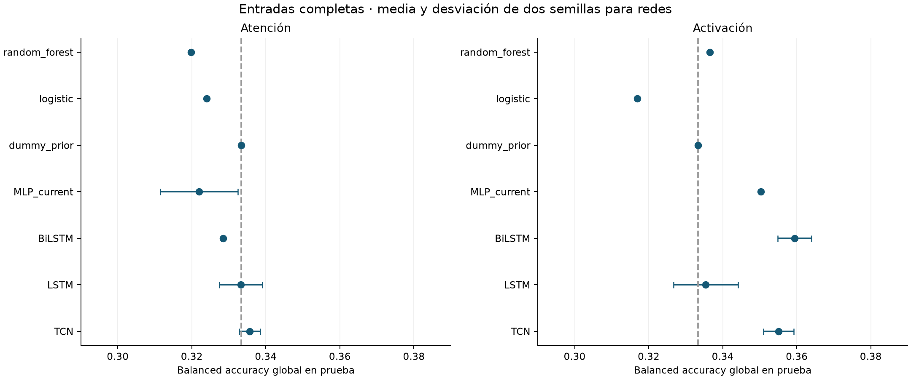
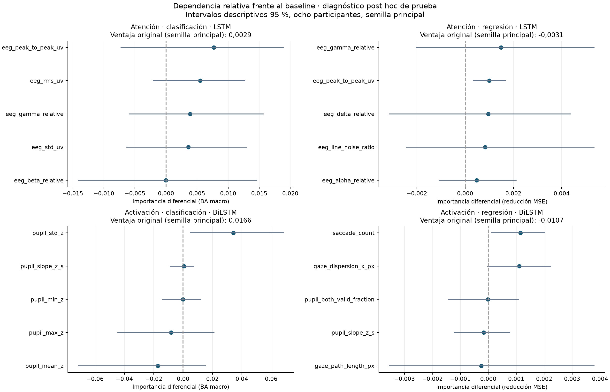

# TCN, LSTM y BiLSTM — resultados del 07-09-2026

Fuente: ejecución local de `entrenar_temporales.py`, `evaluar_temporales.py` y `verificar_temporales.py`. Las fechas UTC de los manifiestos pueden corresponder al 08-09; la fecha local de Chile de esta entrega es 07-09-2026.

## Resultado principal

**La clasificación de activación presenta mejoras puntuales frente a algunos baselines, pero el experimento no demuestra una ventaja general del historial temporal.** En el conjunto completo, la BA global de prueba promediada entre semillas es 0,3551 para TCN, 0,3354 para LSTM y 0,3594 para BiLSTM. La logística estática obtiene 0,3169, RF 0,3365 y el control neuronal sin historial 0,3503. Son configuraciones predefinidas; no se seleccionó el máximo de test como ganador.

La configuración de clasificación de activación elegida **antes de test** fue BiLSTM con cinco variables pupilares sin la columna explícita de validez. Obtiene BA global media de prueba 0,3472, frente a aproximadamente 0,3929 en validación. Su mejora macro por participante frente a la logística con las mismas cinco entradas es 0,0192, intervalo descriptivo [-0,0065; 0,0449]. La mejora puntual no constituye superioridad confirmada.

LSTM completa de activación supera a la logística completa en BA macro por participante: +0,0212, intervalo [0,0058; 0,0400]. Frente al control neuronal sin historial, la diferencia es -0,0032, intervalo [-0,0312; 0,0193]. Esta comparación limita la atribución de la mejora a temporalidad.



En atención, los resultados de clasificación permanecen cerca del nivel trivial. Los R² de prueba de los scores continuos quedan alrededor de cero; el experimento no mejora de forma clara esa parte del problema.

## Qué se entrenó y guardó

**104 redes guardadas**: 32 TCN, 32 LSTM, 32 BiLSTM y 8 controles MLP_current. Corresponden a dos tareas, clasificación/regresión, los ocho conjuntos congelados y dos semillas (20260907/20260908). El MLP se usa en los conjuntos completos. Se guardan pesos, metadatos, preprocesadores, historiales por época, predicciones y probabilidades, selección anterior a test y métricas.

Se mantuvieron 25 participantes de entrenamiento (13.524 ventanas), ocho de validación (4.662) y ocho de prueba (4.025). P29 y excluidos no entran en esta ejecución. Las etiquetas principales y el contexto GSR de 6 s permanecen fijos. No se construyeron nuevas pseudoetiquetas ni se entrenó sobre señales crudas.

## Secuencias y arquitectura

Cada predicción usa la ventana actual y hasta siete anteriores del mismo participante, grabación, segmento y estímulo, con avance exacto de 1 s. La secuencia se reinicia ante cualquier hueco. Ocho ventanas de 2 s solapadas abarcan un máximo de 9 s. Se conserva cada ventana elegible; las secuencias cortas llevan padding cero a derecha después del escalado y su longitud real se pasa al modelo. El padding no puede modificar la predicción.

TCN tiene dos bloques residuales, cada uno con dos convoluciones causales de kernel 3, dilataciones 1 y 2, 24 canales, ReLU y dropout 0,2. Su campo receptivo teórico es de 13 pasos y se limita al contexto disponible de hasta ocho. LSTM tiene una capa de 24 unidades. BiLSTM tiene 24 unidades por dirección y concatena los estados finales de ambas direcciones. La cabeza lineal entrega tres logits o un score continuo.

La BiLSTM recorre en ambas direcciones **solo la historia disponible hasta la ventana objetivo**. No es una BiLSTM centrada que lea ventanas posteriores. La normalización original de features y etiquetas es, sin embargo, offline por participante: el sistema completo todavía no representa una validación de inferencia causal en tiempo real.

MLP_current usa dos capas de 24 unidades y lee únicamente la ventana actual. Comparte entrenamiento y preprocesamiento; su número de parámetros no es idéntico al de las redes temporales. Es un control de acceso al historial, no un aislamiento perfecto de todas las diferencias de arquitectura.

No se entrenó MLP_current para los conjuntos reducidos; por ello la ventaja de BiLSTM con cinco variables frente a la logística no aísla por sí sola el efecto del historial de las diferencias entre familias.

| Objetivo | Split | Ventanas | Historia media | Solo ventana actual | Ocho ventanas |
| --- | --- | --- | --- | --- | --- |
| Atención | validation | 4662 | 4,9959 | 15.9 % | 34.1 % |
| Atención | test | 4025 | 4,9284 | 17.1 % | 34.2 % |
| Activación | validation | 4662 | 4,9959 | 15.9 % | 34.1 % |
| Activación | test | 4025 | 4,9284 | 17.1 % | 34.2 % |

Las métricas sobre ventanas con ocho pasos también están en los CSV con `scope=history_8`, tanto para los temporales como para los estáticos, sobre los mismos endpoints. Las tablas principales usan todas las ventanas.

## Entrenamiento y selección

La mediana de imputación, indicadores de ausencia y StandardScaler se ajustan solo en train para cada conjunto. AdamW usa learning rate 0,001, weight decay 0,0001, batch 256 y recorte del gradiente a norma 1. Se permiten hasta 30 épocas, mínimo ocho, paciencia seis y mejora mínima 0,0001. Clasificación usa entropía cruzada ponderada con frecuencias de train; regresión, MSE.

Se conserva por semilla la época con mejor BA macro por participante (clasificación) o menor MSE macro (regresión) en validación. Luego se elige arquitectura/conjunto por la media de esas métricas en las dos semillas, por separado para el panel y para el conjunto completo. Esta selección se escribe antes de evaluar test. Las redes se ejecutaron en CPU, cuatro hilos, PyTorch 2.14.0+cpu y algoritmos deterministas.

El baseline de referencia se elige por validación entre Dummy, logística/Ridge y RF con las mismas entradas; además se reporta la referencia completa. Los pesos estáticos son los guardados en la etapa anterior. La búsqueda temporal tiene más configuraciones y épocas que los baselines estáticos originales: este es un contraste exploratorio, no un estudio con igual presupuesto de optimización por familia.

## Comparación con entradas completas

BA y R² son métricas globales por ventana. Para las redes se muestra media ± desviación estándar de dos semillas; esta desviación no es un intervalo de confianza. La selección se hizo con la métrica macro por participante, que puede ordenar los modelos de otra manera.

### Atención: clasificación

| Modelo | Validación: balanced_accuracy | Prueba: balanced_accuracy |
| --- | --- | --- |
| dummy_prior | 0,3333 | 0,3333 |
| logistic | 0,3357 | 0,3240 |
| random_forest | 0,3199 | 0,3197 |
| BiLSTM | 0,3407 ± 0,0067 | 0,3284 ± 0,0003 |
| LSTM | 0,3401 ± 0,0025 | 0,3333 ± 0,0058 |
| MLP_current | 0,3491 ± 0,0038 | 0,3220 ± 0,0105 |
| TCN | 0,3471 ± 0,0077 | 0,3356 ± 0,0028 |

### Atención: regresión

| Modelo | Validación: r2 | Prueba: r2 |
| --- | --- | --- |
| dummy_mean | 0,0000 | 0,0000 |
| random_forest | -0,0844 | -0,0705 |
| ridge | -0,0001 | -0,0025 |
| BiLSTM | -0,0007 ± 0,0014 | -0,0037 ± 0,0012 |
| LSTM | -0,0023 ± 0,0009 | -0,0030 ± 0,0025 |
| MLP_current | -0,0013 ± 0,0005 | -0,0007 ± 0,0008 |
| TCN | -0,0022 ± 0,0013 | -0,0045 ± 0,0015 |

### Activación: clasificación

| Modelo | Validación: balanced_accuracy | Prueba: balanced_accuracy |
| --- | --- | --- |
| dummy_prior | 0,3333 | 0,3333 |
| logistic | 0,3626 | 0,3169 |
| random_forest | 0,3243 | 0,3365 |
| BiLSTM | 0,3619 ± 0,0045 | 0,3594 ± 0,0045 |
| LSTM | 0,3697 ± 0,0103 | 0,3354 ± 0,0088 |
| MLP_current | 0,3762 ± 0,0048 | 0,3503 ± 0,0004 |
| TCN | 0,3617 ± 0,0073 | 0,3551 ± 0,0041 |

### Activación: regresión

| Modelo | Validación: r2 | Prueba: r2 |
| --- | --- | --- |
| dummy_mean | 0,0000 | 0,0000 |
| random_forest | -0,0352 | -0,0073 |
| ridge | 0,0054 | 0,0051 |
| BiLSTM | -0,0005 ± 0,0066 | -0,0010 ± 0,0033 |
| LSTM | -0,0056 ± 0,0001 | 0,0003 ± 0,0069 |
| MLP_current | 0,0008 ± 0,0035 | 0,0029 ± 0,0022 |
| TCN | -0,0005 ± 0,0014 | -0,0031 ± 0,0032 |

## Configuraciones seleccionadas antes de test y diferencias pareadas

Ganancias positivas indican mejora: aumento de BA macro o reducción del MSE macro por participante. Se promedian primero ambas semillas de cada participante y se remuestrean los ocho participantes 2.000 veces. Los intervalos de 95 % son descriptivos, sin corrección por comparaciones múltiples ni repetición de la partición de sujetos. No prueban causalidad ni equivalencia. Test ya había sido evaluado en los baselines anteriores; esta entrega no lo utiliza para seleccionar ni reajustar modelos.

| Objetivo | Tarea | Selección | Red | Entradas | BA / R² test | Baseline mismas entradas | Ganancia macro | Intervalo 95 % |
| --- | --- | --- | --- | --- | --- | --- | --- | --- |
| Activación | clasificación | panel | BiLSTM | Pupil_no_quality | 0,3472 | logistic | 0,0192 | [-0,0065; 0,0449] |
| Activación | clasificación | full | LSTM | full | 0,3354 | logistic | 0,0212 | [0,0058; 0,0400] |
| Activación | regresión | panel | BiLSTM | Eye_Pupil | -0,0006 | ridge | -0,0075 | [-0,0242; 0,0049] |
| Activación | regresión | full | BiLSTM | full | -0,0010 | ridge | -0,0068 | [-0,0298; 0,0080] |
| Atención | clasificación | panel | LSTM | EEG | 0,3264 | logistic | 0,0078 | [-0,0019; 0,0170] |
| Atención | clasificación | full | TCN | full | 0,3356 | logistic | 0,0112 | [-0,0023; 0,0262] |
| Atención | regresión | panel | LSTM | EEG | -0,0029 | dummy_mean | -0,0027 | [-0,0063; 0,0013] |
| Atención | regresión | full | BiLSTM | full | -0,0037 | ridge | -0,0008 | [-0,0066; 0,0049] |

Las diferencias frente al baseline completo y frente al MLP_current están en `ganancias_vs_baseline.csv`; las contribuciones de cada participante y semilla están en `ganancias_por_participante.csv`.

## Qué variables explican la diferencia frente al baseline

**`pupil_std_z`, variabilidad de la pupila, destaca en la BiLSTM seleccionada para clasificación de activación.** En la semilla principal, su importancia diferencial es 0,0190 en validación y 0,0342 en prueba. En prueba, alterar esa entrada empeora la BiLSTM en 0,0125 de BA macro y mejora la logística en 0,0217: ambos efectos explican la diferencia de 0,0342. No es una contribución aditiva de 3,42 puntos al desempeño del modelo.

El desplazamiento conjunto de todas las entradas pupilares tiene importancia diferencial negativa en prueba (-0,0049), aunque positiva en validación (0,0190). La dependencia de una variable aislada no demuestra que toda la modalidad sostenga una ventaja estable. Para atención, las amplitudes EEG aparecen en el ranking, con intervalos amplios y sin mejora clara generalizable del modelo seleccionado.

Se explican los ocho modelos elegidos por validación (panel y completo), usando la semilla principal 20260907. La sensibilidad entre semillas se evalúa para desempeño, no para todos los rankings de importancia. Se desplaza cada feature cruda dentro de participante/grabación/segmento cinco veces y se reconstruyen las secuencias; las modalidades se desplazan conjuntamente. Se conservan longitud y endpoint de las secuencias, no las relaciones con las otras variables. Son perturbaciones diagnósticas, no nuevas trayectorias fisiológicas observadas.

Se guarda **I temporal**, caída de score del temporal; **I baseline**, caída del estático; y **I diferencial = I temporal − I baseline**. Esta última equivale a la ventaja original menos la ventaja tras perturbar. Un valor positivo indica dependencia relativa del temporal; no prueba que haya una mejora global si la ventaja original es nula o negativa. Los scores son BA macro o MSE con signo invertido para que mayor sea mejor.

Las siguientes tablas son diagnóstico post hoc en prueba de los modelos del panel. No se usaron para elegir features ni volver a entrenar. Las tablas completas, modalidades y validación quedan en los CSV.

### Activación · clasificación · BiLSTM / Pupil_no_quality

Ventaja original frente al baseline, semilla principal: 0,0166.

| Variable | I temporal | I baseline | I diferencial | Intervalo diferencial |
| --- | --- | --- | --- | --- |
| pupil_std_z | 0,0125 | -0,0217 | 0,0342 | [0,0046; 0,0685] |
| pupil_slope_z_s | 0,0034 | 0,0028 | 0,0006 | [-0,0092; 0,0076] |
| pupil_min_z | -0,0005 | -0,0003 | -0,0001 | [-0,0142; 0,0124] |
| pupil_max_z | -0,0257 | -0,0175 | -0,0081 | [-0,0448; 0,0214] |
| pupil_mean_z | -0,0127 | 0,0045 | -0,0173 | [-0,0716; 0,0156] |

### Activación · regresión · BiLSTM / Eye_Pupil

Ventaja original frente al baseline, semilla principal: -0,0107.

| Variable | I temporal | I baseline | I diferencial | Intervalo diferencial |
| --- | --- | --- | --- | --- |
| saccade_count | 0,0008 | -0,0003 | 0,0012 | [0,0001; 0,0020] |
| gaze_dispersion_x_px | 0,0011 | -0,0000 | 0,0011 | [-0,0000; 0,0022] |
| pupil_both_valid_fraction | 0,0001 | 0,0001 | -0,0000 | [-0,0014; 0,0011] |
| pupil_slope_z_s | -0,0002 | -0,0001 | -0,0002 | [-0,0012; 0,0008] |
| gaze_path_length_px | 0,0001 | 0,0003 | -0,0003 | [-0,0036; 0,0038] |

### Atención · clasificación · LSTM / EEG

Ventaja original frente al baseline, semilla principal: 0,0029.

| Variable | I temporal | I baseline | I diferencial | Intervalo diferencial |
| --- | --- | --- | --- | --- |
| eeg_peak_to_peak_uv | -0,0014 | -0,0090 | 0,0077 | [-0,0073; 0,0189] |
| eeg_rms_uv | 0,0006 | -0,0049 | 0,0055 | [-0,0021; 0,0127] |
| eeg_gamma_relative | -0,0022 | -0,0061 | 0,0038 | [-0,0060; 0,0157] |
| eeg_std_uv | -0,0005 | -0,0041 | 0,0036 | [-0,0064; 0,0131] |
| eeg_beta_relative | -0,0076 | -0,0076 | -0,0000 | [-0,0142; 0,0147] |

### Atención · regresión · LSTM / EEG

Ventaja original frente al baseline, semilla principal: -0,0031.

| Variable | I temporal | I baseline | I diferencial | Intervalo diferencial |
| --- | --- | --- | --- | --- |
| eeg_gamma_relative | 0,0015 | 0,0000 | 0,0015 | [-0,0020; 0,0054] |
| eeg_peak_to_peak_uv | 0,0010 | 0,0000 | 0,0010 | [0,0003; 0,0017] |
| eeg_delta_relative | 0,0010 | 0,0000 | 0,0010 | [-0,0032; 0,0044] |
| eeg_line_noise_ratio | 0,0008 | 0,0000 | 0,0008 | [-0,0025; 0,0054] |
| eeg_alpha_relative | 0,0005 | 0,0000 | 0,0005 | [-0,0011; 0,0021] |

## Dependencia del historial

Dos controles de inferencia conservan la ventana actual: repetirla en todas las posiciones anteriores y revertir el orden del pasado. La diferencia positiva indica pérdida al alterar el historial. No son modelos reajustados y pueden crear entradas fuera de distribución. Las longitudes se conservan para no confundir el efecto con el inicio de un segmento. El MLP_current aporta el control entrenado sin historial.

| Objetivo | Tarea | Entradas | Red | Control | Pérdida macro | Intervalo |
| --- | --- | --- | --- | --- | --- | --- |
| Activación | clasificación | Pupil_no_quality | BiLSTM | repeat_endpoint_in_past | 0,0133 | [-0,0113; 0,0386] |
| Activación | clasificación | Pupil_no_quality | BiLSTM | reverse_past_keep_endpoint | 0,0115 | [-0,0103; 0,0377] |
| Activación | clasificación | full | LSTM | repeat_endpoint_in_past | 0,0156 | [0,0003; 0,0300] |
| Activación | clasificación | full | LSTM | reverse_past_keep_endpoint | -0,0201 | [-0,0379; -0,0050] |
| Activación | regresión | Eye_Pupil | BiLSTM | repeat_endpoint_in_past | 0,0045 | [0,0001; 0,0088] |
| Activación | regresión | Eye_Pupil | BiLSTM | reverse_past_keep_endpoint | 0,0001 | [-0,0030; 0,0026] |
| Activación | regresión | full | BiLSTM | repeat_endpoint_in_past | 0,0057 | [0,0002; 0,0110] |
| Activación | regresión | full | BiLSTM | reverse_past_keep_endpoint | 0,0039 | [-0,0017; 0,0099] |
| Atención | clasificación | EEG | LSTM | repeat_endpoint_in_past | -0,0019 | [-0,0099; 0,0082] |
| Atención | clasificación | EEG | LSTM | reverse_past_keep_endpoint | -0,0098 | [-0,0166; -0,0036] |
| Atención | clasificación | full | TCN | repeat_endpoint_in_past | 0,0051 | [-0,0035; 0,0136] |
| Atención | clasificación | full | TCN | reverse_past_keep_endpoint | -0,0016 | [-0,0123; 0,0099] |
| Atención | regresión | EEG | LSTM | repeat_endpoint_in_past | -0,0007 | [-0,0014; 0,0000] |
| Atención | regresión | EEG | LSTM | reverse_past_keep_endpoint | -0,0008 | [-0,0019; 0,0005] |
| Atención | regresión | full | BiLSTM | repeat_endpoint_in_past | -0,0003 | [-0,0026; 0,0020] |
| Atención | regresión | full | BiLSTM | reverse_past_keep_endpoint | -0,0008 | [-0,0035; 0,0018] |

Hay controles en que invertir el pasado mejora el resultado. Esto impide interpretar cualquier ganancia frente al baseline como prueba automática de que el orden temporal aprendido es útil.

## Límites y continuidad

- Los objetivos son pseudoetiquetas; no hay validación externa del constructo psicológico.
- La normalización offline por participante impide afirmar rendimiento en tiempo real.
- Ocho ventanas es un contexto inicial fijo, no una longitud óptima demostrada.
- Dos semillas y ocho participantes de prueba dan evidencia limitada de estabilidad.
- Las variables correlacionadas y las fracciones de calidad pueden afectar el ranking.
- No se repitió CV por participante para cada red; se usó el split 25/8/8 ya fijado.
- La presente ejecución usa concatenación temprana de features; no completa aún el contraste de todas las estrategias de fusión de la tesis.

El siguiente estudio debe fijar hipótesis concretas sobre contexto y fusión, conservar controles de ventana actual y probarlas sin ajustar decisiones a estos resultados de test. Esta entrega registra las mejoras observadas y sus límites; no declara confirmada la hipótesis central.

## Archivos, carga y reproducción

Dependencias y ejecución desde la raíz del repositorio:

```powershell
python -m pip install -r requirements_temporales.txt
python scripts/entrenar_temporales.py
python scripts/evaluar_temporales.py
python -m unittest discover -s tests
python scripts/verificar_temporales.py
python scripts/informe_temporales.py
```

El entrenamiento rechaza una salida existente. Para reproducir sin sobrescribir esta entrega, usar otra copia limpia del proyecto y una ruta nueva con `--output`; los scripts posteriores leen la constante `OUT` de `temporales_core.py`, que debe apuntar a esa nueva ejecución. El informe requiere Matplotlib 3.11.1 además de las dependencias del entrenamiento. No se borran ejecuciones anteriores.

- `protocolo.json`: arquitectura, hiperparámetros, entradas, versiones y hashes.
- `catalogo_modelos.json`, `preprocesadores.json`, `modelos/`: pesos `.pt`, metadatos `.json` y preprocesadores `.joblib`.
- `seleccion_antes_test.json`, `referencias_estaticas_antes_test.json`: decisiones congeladas.
- `historial_entrenamiento.csv`: pérdidas y selección por época.
- `metricas_temporales.csv`, `metricas_estaticos_mismas_ventanas.csv`: desempeño comparable.
- `predicciones_temporales.csv.gz`: predicciones, probabilidades, split y fila de origen.
- `ganancias_vs_baseline.csv`, `ganancias_por_participante.csv`: comparaciones pareadas.
- `importancia_vs_baseline.csv`, `importancia_vs_baseline_por_participante.csv`: rankings y diferencias.
- `dependencia_del_historial.csv`: controles de historial.
- `secuencias_*.csv.gz`, `cobertura_*.csv`: historial disponible por endpoint.
- `verificacion_entrega.json`, `pruebas.txt`: auditoría y resultados de pruebas.

Ejemplo de carga de un modelo propio, desde la raíz del repositorio:

```python
import sys, json, joblib
sys.path.insert(0, "scripts")
from temporales_core import OUT, load_net, history_indices, sequence_array, raw_predict, decode
catalog = json.loads((OUT / "catalogo_modelos.json").read_text(encoding="utf-8"))
meta = catalog[0]  # elegir por task, kind, subset, architecture y seed
model = load_net(meta)
prep = joblib.load(OUT / meta["preprocessor"])
# frame: ventanas cronologicas con identidad, split y las features originales
indices, lengths = history_indices(frame, meta["context_windows"])
x = sequence_array(prep.transform(frame[meta["features"]]), indices)
prediction = decode(raw_predict(model, x, lengths), meta["kind"])
```

## Verificación

26 pruebas aprobadas. Se verificaron 104 modelos, 903,448 predicciones, 208 métricas globales recalculadas y 280 identidades de importancia diferencial. Los pesos recargados reproducen exactamente los logits/scores de validación. Se auditó que las secuencias no crucen personas, segmentos, estímulos ni huecos y que nunca incorporen ventanas posteriores al endpoint.

## Referencias

[Bai, Kolter y Koltun (2018)](https://arxiv.org/abs/1803.01271) describen las TCN residuales con convoluciones causales dilatadas usadas como referencia arquitectónica. Esta implementación pequeña no replica sus benchmarks.

[Documentación de LSTM de PyTorch](https://docs.pytorch.org/docs/2.14/generated/torch.nn.modules.rnn.LSTM.html) especifica los estados finales bidireccionales empleados aquí; [guardado y carga](https://docs.pytorch.org/tutorials/beginner/saving_loading_models.html) documenta la persistencia mediante state_dict.


